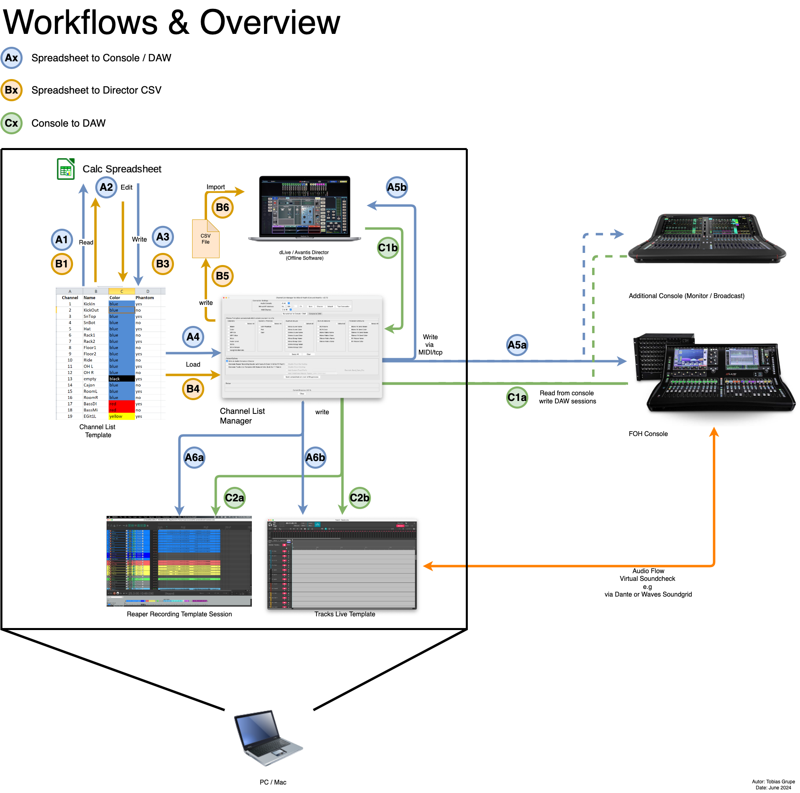
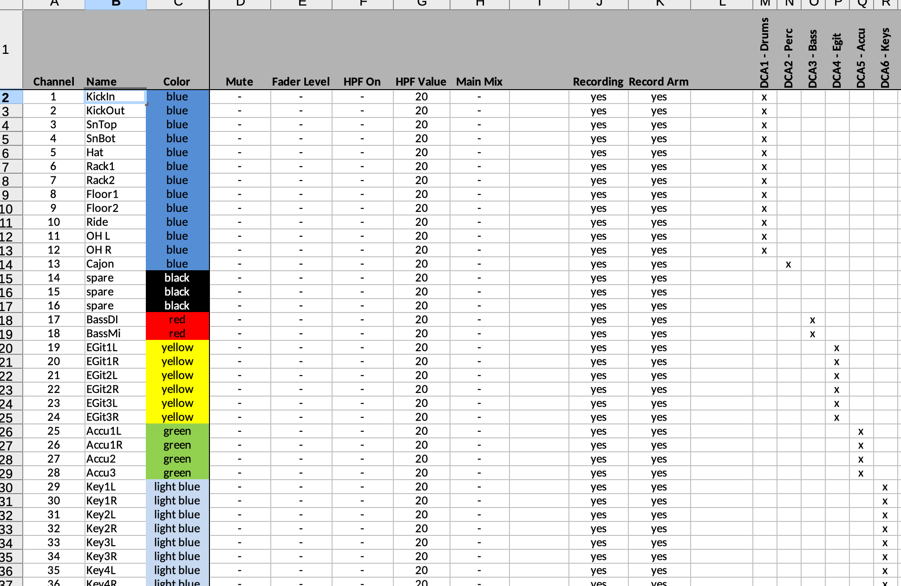
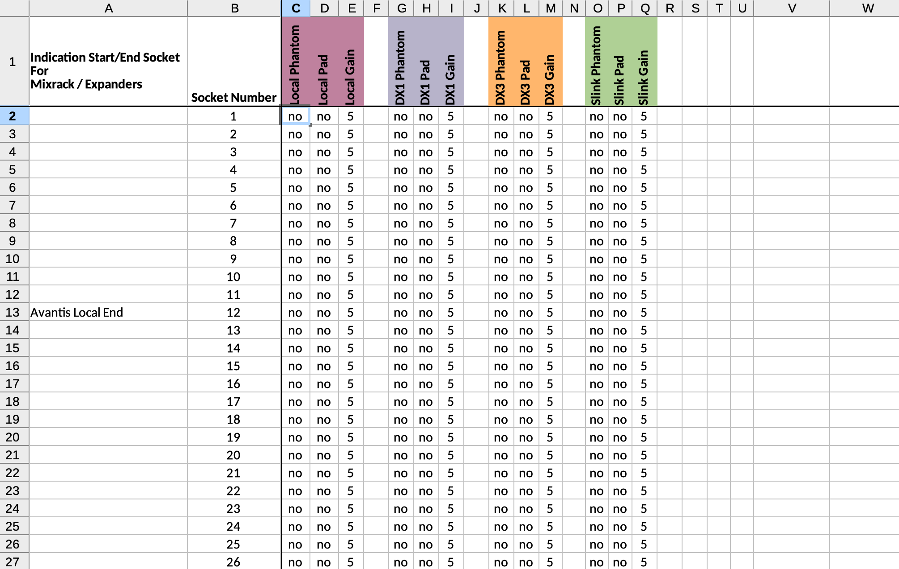
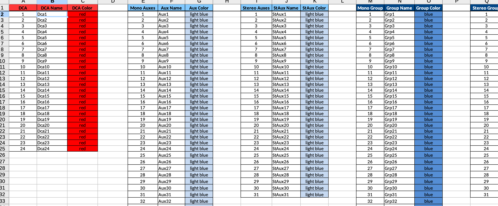
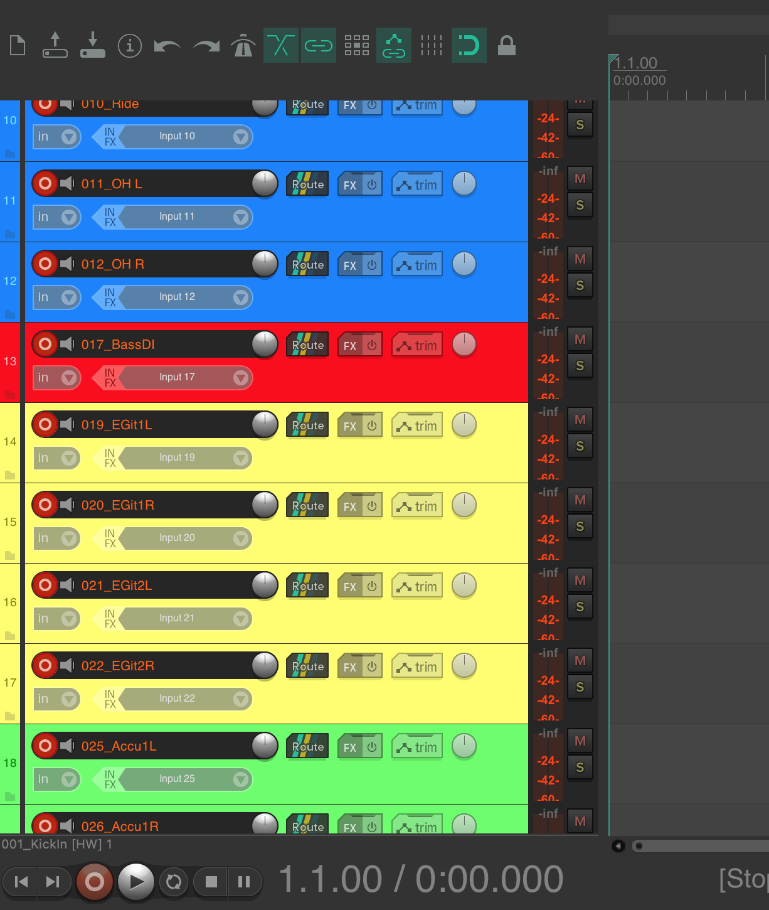

# dlive-midi-tools
## Description
Python and midi/tcp based tool to prepare channel lists for Allen &amp; Heath dlive & Avantis. Based on a spreadsheet the following parameters can be preconfigured and in one or more steps be written into real dlive systems or into dLive Director via midi/tcp. Additionally from the same spreadsheet a DAW recording session for Reaper can be generated. 
- Channel Name
- Channel Color
- Channel Mute
- Fader Level
- DCA Assignments
- 48V Phantom Power (Local, DX1 & DX3, SLink) 
- PAD (Local, DX1 & DX3, SLink)
- Gain (Local, DX1 & DX3, SLink)
- DCA Name & Color
- Aux Name & Color
- Group Name & Color
- Matrices Name & Color
- FX Sends Name & Color
- FX Returns Name & Color
- Mute Group Assignments (dLive only)
- HPF On (dLive only)
- HPF Value (dLive only)

more information about future releases can be found in the [wiki](https://github.com/togrupe/dlive-midi-tools/wiki)

## Use Cases

* Single source (spreadsheet) for channel lists in single or multi console situations
* Better overview on all channels during preparation phase
* Sync channel names and colors between consoles and DAW for virtual soundchecks
* Supports dLive & dLive Director
* Supports Avantis & Avantis Director

## Software Liability Warning

This software is provided "as is," without warranty of any kind, express or implied, including but not limited to the warranties of merchantability, fitness for a particular purpose, and non-infringement. In no event shall the authors or copyright holders be liable for any claim, damages, or other liability, whether in an action of contract, tort, or otherwise, arising from, out of, or in connection with the software or the use or other dealings in the software.

Furthermore, this software may be subject to known or unknown bugs, errors, and vulnerabilities, which may result in unexpected behavior or security breaches. The authors or copyright holders shall not be liable for any damages or losses resulting from such bugs, errors, or vulnerabilities.

By using this software, you acknowledge and agree that you do so at your own risk and that you will be solely responsible for any damages or losses that may arise from such use.

## Used Python Libraries
* mido - Midi Library
* pandas - spreadsheet reader/writer
* reathon - Reaper Session Creator
* pyinstaller - Binary creator

## Overview

## Download
| Version | Date       | OS                 | Download                                                                                         | Release Notes |
|---------|------------|--------------------|--------------------------------------------------------------------------------------------------|---------------|
| v2.4.0  |            | MacOS (x86_64)     |                                                                                                  | [Link](#v240) | 
|         |            | Windows (x86_64)   |                                                                                                  |               |
| v2.3.0  | 19.05.2023 | MacOS (x86_64)     | [Link](https://liveworks-vt.de/downloads/dlive-midi-tools/v2_3_0/dmt-v2_3_0-macos.zip)           | [Link](#v230) | 
|         |            | Windows (x86_64)   | [Link](https://liveworks-vt.de/downloads/dlive-midi-tools/v2_3_0/dmt-v2_3_0-windows.zip)         |               |
| v2.2.0  | 29.04.2023 | MacOS (x86_64)     | [Link](https://liveworks-vt.de/downloads/dlive-midi-tools/v2_2_0/dmt-v2_2_0-macos.zip)           | [Link](#v220) |
|         |            | Windows (x86_64)   | [Link](https://liveworks-vt.de/downloads/dlive-midi-tools/v2_2_0/dmt-v2_2_0-windows.zip)         |               |
| v2.1.0  | 31.03.2023 | MacOS (x86_64)     | [Link](https://liveworks-vt.de/downloads/dlive-midi-tools/v2_1_0/macos/dmt-v2_1_0-macos.zip)     |               |
|         |            | Windows (x86_64)   | [Link](https://liveworks-vt.de/downloads/dlive-midi-tools/v2_1_0/windows/dmt-v2_1_0-windows.zip) |               |

## Input file / The Spreadsheet Template
An example spreadsheet file named: **dLiveChannelList.xlsx** can be found in the root folder. 
By default, the channels 1-128 are available in the sheet. If you need less, 
just delete the channels you don't want to process.  

You can also write in blocks. e.g. 
* CH1-16
* CH25-32
* CH97-128

in this case the not mentioned channels are not touched, this works as well for the  `Groups`.

Empty lines in between are **not** supported.  

Microsoft Excel and LibreOffice Calc Spreadsheet can be used to write / save the sheets.
Please make sure that you save your changes in the (*.xlsx or *.ods) format.

### Channel Overview

More details to the `Channels` columns can be found [here](doc/channels/README.md)

### Sockets Overview

More details to the `Sockets` columns can be found [here](doc/sockets/README.md)

### Groups Overview

More details to the `Groups` columns can be found [here](doc/groups/README.md)

# Example Generated Reaper Recording Session
If you select the "Generate Reaper Recording Session" checkbox, 
the columns `Name`, `Color`, `Recording` and `Record Arm` are considered for the template generation process. 

## Settings on the dlive console
The `Midi Channel` setting on dLive under `Utils/Shows -> Control -> Midi` should be set to : `12 to 16`, which is default.

If you want to change the preconfigured Midi port, you can change it in the Graphical User Interface according to your dlive settings. 

## Default ip and port
The default dlive mixrack ip-address is: 192.168.1.70. This IP-Address is preconfigured in the scripts. If you want to 
change it, you can edit the field `ip` in the file: dliveConstants.py or during runtime within the Graphical User Interface.  

Please make sure that your ethernet or Wi-Fi interface has an ip address in the same subnet. e.g. Ip: 192.168.1.10 / Subnet: 255.255.255.0
 

## Usage
Prerequisites: 
* Python >= 3.8
* dlive Firmware: >= 1.97
* Avantis Firmware: >= 1.25
* Reaper >= 6.75

1. Recommendation: Please back up your current show file, just to be on the safe side if something goes wrong.

2. Before you run the script, please run the following command to download the required python modules using `pip`. Please make sure `pip` is installed.

`pip install -r dependencies.txt`

3. Run the script with the following command: 

`python3 Main.py`

4. (Optional) If you want to make a binary out of it, please do the following: 

    4.1 Installation of pyinstaller

    `pip install pyinstaller`

    4.2 Create a onefile binary (works for Windows and MacOS)

    `pyinstaller.exe --onefile -w Main.py`

Afterwards the following window appears. 

1. Select the console: `dLive` or `Avantis`

2. Check the (Mixrack-) IP and Midi Port. 

3. `Save` Persists the current settings (console, ip, midi-port) for the next start of the tool.

4. `Director`, sets the ip to 127.0.0.1, to use Director locally on the same machine. Director has to be started before. You can also write to a Director instance running on a different machine, in this case please use the external ip-address of this machine where director is already started and running. (In case of connection issues, please check the firewall rules or disable it temporarily)

5. `Default` Sets the ip back to default: 192.168.1.70.

6. `Test Connection` Tries to establish an test connection to the console. In both cases (successful/failed) you will be informed by a messagebox.

7. Select the spreadsheet columns you want to write, and select `Write to Audio Console or Director`.
   
   `Select All` selects all checkboxes.
   `Clear` removes all ticks.

8. If you also want to create a Reaper template session, set the corresponding tick. The Reaper session file `<input-spread-sheet-file>-recording-template.rpp` 
   will be generated into the directory from where the spreadsheet has been chosen. In the `Channels` Tab, you can configure, which channel shall be recorded, and "record armed". The patching is 1:1 (derived from the channel number) 
   You can also use the tool to create only the Reaper session file, in case you use a different console. 

9. Click the button `Open spreadsheet and start writing process` to select your custom Excel sheet. Afterwards the selected action(s) start automatically.

10. If something goes wrong, please check the python console or the `main.log`

If you find any issues, please let me know. New ideas are welcome. 

Have fun! 

## Release Notes

### v2.4.0

Feature & Maintenance Release

#### New Features:
- DCA Name & Color
- Aux Name & Color
- Group Name & Color
- Matrices Name & Color
- FX Sends Name & Color
- FX Returns Name & Color
- Current Processing Action now shown in UI
- Test Connection Button added
- Select All Button added
- Clear Button added

#### Improvements
- HPF Value Formula improved
- Channels > 64 skipped for Avantis
- UI Error Handling improved
- Repository reorganized

#### Technical Limitations
- DX2 (Pad/Phantom/Gain) for Avantis via SLink is currently due to technical limitation not possible.
- HPF on, HPF value and Mute Groups for Avantis due to technical limitation currently not possible.

#### Issues fixed:

#### Known issues:

### v2.3.0

Feature Release

#### New Features:
- Fader Level Support
- Gain Support
- DCA Support
- Mute Group Support (dLive only)
- HPF On Support (dLive only)
- HPF Value Support (dLive only)

#### Improvements
- Progress Bar improved
- Infobox for missing Avantis features added
- Checkbox Groups introduced
- Checkbox Group "Select All" added
- IP-Address Label is now dynamic
- Processing accelerated

#### Technical Limitations
- DX2 (Pad/Phantom/Gain) for Avantis via SLink is currently due to technical limitation not possible.
- HPF on, HPF value and Mute Groups for Avantis due to technical limitation currently not possible.

#### Issues fixed:

#### Known issues:

### v2.2.0

Feature Release

#### New Features:
- Avantis support
- Director button introduced
- Save button added, to persist data
- Default button added, to set back the ip to default
- Recordable & Record Arm feature added
- Reaper template is now generated right next to the chosen spreadsheet with the same name as prefix

#### Technical Limitations
- DX2 (Pad/Phantom) for Avantis via SLink is currently due to technical limitation not possible.

#### Issues fixed:
- Temporary GUI freeze fixed

#### Improvements
- Robustness improved

#### Known issues:
