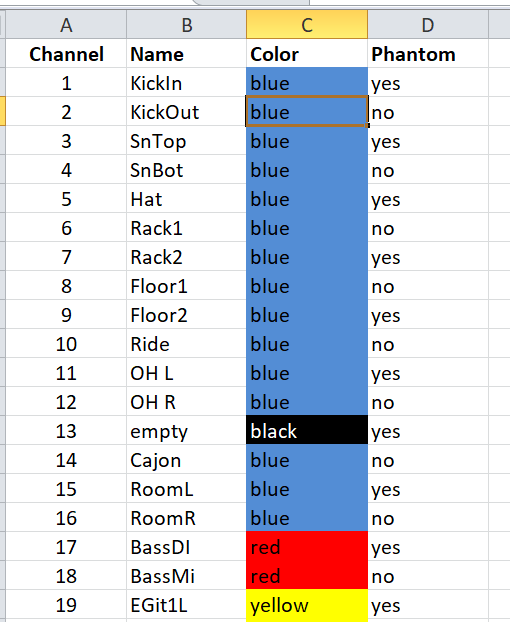

# dlive-midi-tools
## Description
Python and midi/tcp based tool to prepare channel lists for Allen &amp; Heath dlive systems. Based on an excel sheet the following parameters can be preconfigured and in one or more steps be written into the dlive system via midi/tcp. 
- Channel Name
- Channel Color
- Channel HPF On & Value
- 48V Phantom Power (Local, DX1 & DX3)
- Channel PAD (Local, DX1 & DX3)
- Channel DCA Assign

## Use Cases
* Single source (excel sheet) for channel lists in multi console situations
* Better overview on all channels during preparation phase
* Sync channel names and colors for virtual soundchecks

## Used Python Libraries
* mido - Midi Library
* pandas - excel reader/writer
* reathon - Reaper Session Creator

## Overview

## Input file
Excel sheet, please edit the columns: Name, Color and Phantom

An example Excel file named: **dLiveChannelList.xlsx** can be found in the root folder. 
By default, the channels 1-128 are available in the sheet. If you need less, 
just delete the channels you don't want to process. Empty lines in between are not supported.

Microsoft Excel and LibreOffice Calc Spreadsheet can be used to write / save the sheets.
Please make sure that you save your changes in the (*.xlsx) format. 

The following colors are allowed:
* blue
* red 
* light blue 
* purple 
* green 
* yellow 
* black
* white

If the given color does not match, the default color black is used instead.

## Settings on the dlive console
The Midi Channel setting on dlive under `Utils/Shows -> Control -> Midi` should be be set to : `12 to 16`, which is default.

If you want to change the preconfigured Midi port, you can change it in the Graphical User Interface according to your dlive settings. 

## Default ip and port
The default dlive mixrack ip address is: 192.168.1.70. This IP-Address is preconfigured in the scripts. If you want to 
change it, you can edit the field `ip` in the file: dliveConstants.py or during runtime within the Graphical User Interface.  

Please make sure that your ethernet or Wi-Fi interface has an ip address in the same subnet. e.g. 192.168.1.10
 

## Usage
Prerequisites: 
* Python >= 3.8
* dlive Firmware: >= 1.90

1. Recommendation: Please backup your current show file, just to be on the safe side if something goes wrong.

2. Before you run the script, please run the following command to download the required python modules using `pip`. Please make sure `pip` is installed.

`pip install -r dependencies.txt`

3. Run the script with the following command: 

`python3 main.py`

Afterwards the following window appears. 

1. Check the Mixrack IP and Midi Port.

2. Select the columns you want to write, 

3. If you want to create a Reaper Template session, set the corresponding tick.

4. click the button "Open Excel Sheet and Trigger Writing Process" to select your custom Excel sheet. Afterwards the selected action(s) start automatically.

5. If something goes wrong, please check the console.

If you find any issues, please let me know.

Have fun!