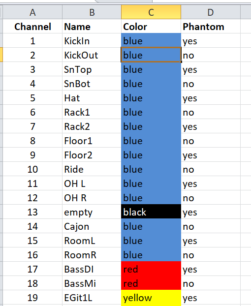
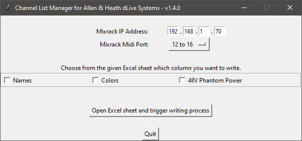

# dlive-midi-tools
## Description
Python and Midi/tcp based tool to prepare channel lists for Allen &amp; Heath dlive systems. Based on an excel sheet the following parameters can be preconfigured and in one step be written into the dlive system via midi/tcp. 
- Channel Name
- Channel Color
- Phantom Power

## Input file
Excel sheet, please edit the columns: Name, Color and Phantom

An example excel file named: **dLiveChannelList.xls** can be found in the root folder. 

The following colors are allowed:
blue, red, light blue, purple, green, yellow, black, white

## Settings on the dlive console
The Midi Channel setting on dlive under Utils/Shows -> Control -> Midi has to be: 1 to 5

## Default ip and port
The default dlive mixrack ip address is: 192.168.1.70. This IP-Address is preconfigured in the scripts. If you want to change it, you can edit the field "ip" in the file: dliveConstants.py.   

## Usage
1. Recommendation: Please backup your current show file, just to be on the safe side if something goes wrong.

2. Before you run the script, please run the following command to download the required python modules.

`pip install -r dependencies.txt`

3. Run the script with the following command: 

`python3 main.py`

Afterwards the following GUI opens automatically. 

Select the columns you want to write, then click the button "Open Excel Sheet and Trigger Writing Process" to select your custom Excel sheet. Afterwards the selected action(s) start automatically.

If you find any issues, please let me know.

Have fun!
