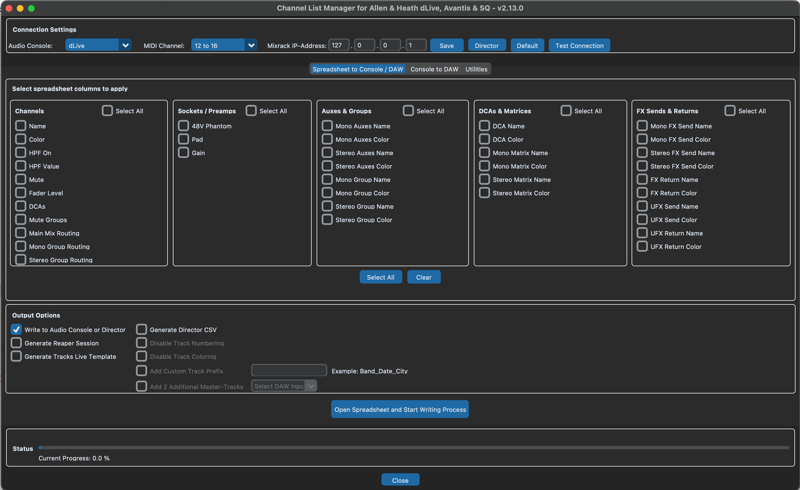
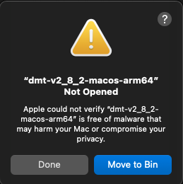
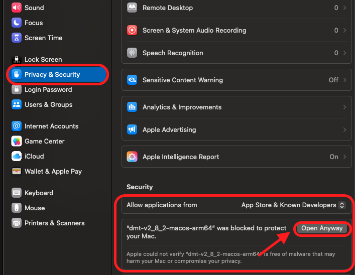
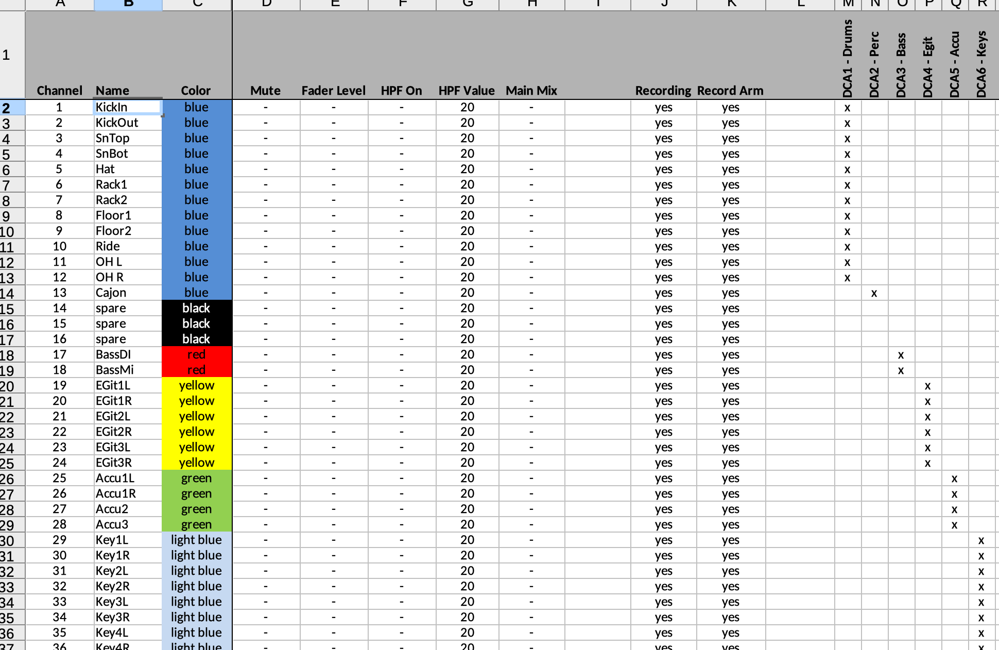
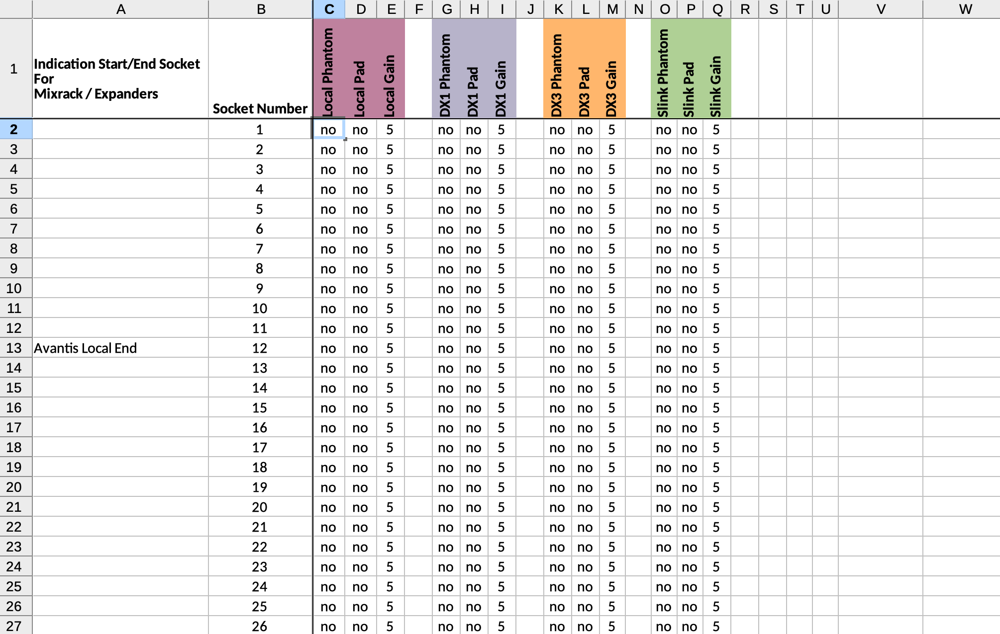
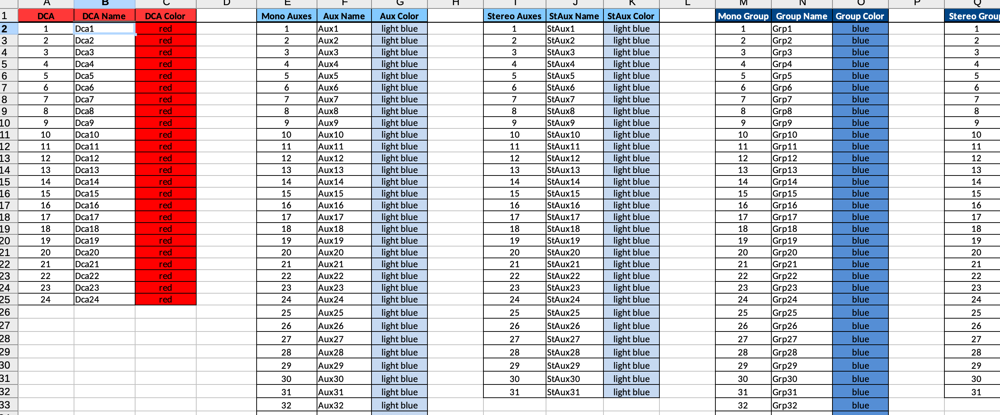
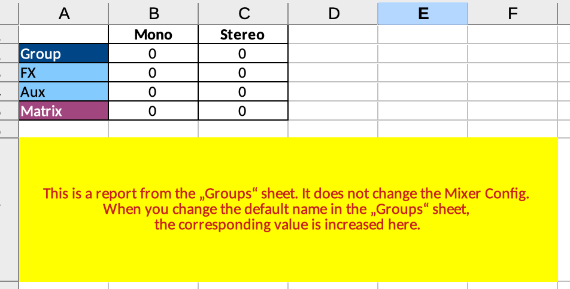

# dlive-midi-tools (dmt)

**Stop typing channel names twice. Stop making mistakes at midnight. Stop building DAW sessions by hand.**

dmt is a free, open-source tool that turns a single spreadsheet into a configured mixing console, a ready-to-record DAW session, and a printable channel list — all in seconds.

**Main Window**



---

## Why dmt?

You've got the channel list in Excel — but the console still needs programming channel by channel. Then the DAW session. Then the PDF for the crew. **dmt eliminates that repetitive work.**

- **One spreadsheet, everything else follows.** Push names, colors, fader levels, routing, gain, phantom power, and more to your console live over the network.
- **No more console ↔ DAW mismatch.** dmt syncs console and DAW from the same source — what you see in Reaper or Tracks Live matches what's on the desk.
- **Prepare offline, deploy in seconds.** Do all prep at home; connect at the venue and push the full channel list in one click.
- **Multi-console, multi-platform.** dLive, Avantis, or Mixing Station (SQ, DM7, Wing, M32/X32, QU) — covered.
- **FOH, monitors, broadcast — one push.** Deploy the same channel list to all consoles. No copy-paste between desks, no name mismatches between positions.
- **PDF channel lists on demand.** Pull the current console state and export a print-ready PDF instantly — no re-typing, no formatting.
- **Dante channel labels without retyping.** Export the channel list as JSON or CSV, compatible with [Dante Config Editor V3](https://github.com/Mamat79/DanteConfigEditorV3) by Mamat79 — from the console/Mixing Station or straight from the spreadsheet.


---

## Who Is It For?

- **Live sound engineers, touring & festival crews** who want fast, reliable, reproducible channel-list deployment across shows, plus synced DAW sessions for virtual soundchecks
- **Recording engineers** who want console and DAW in sync for live recordings
- **Studio engineers** prepping DAW sessions (w/o console usage) ahead of recording sessions

**[⬇ Download the latest version](#download)**

---


## What You Can Configure

- **Name & Color** for Channels, DCAs, Aux, Groups, Matrices, FX Sends/Returns, UFX Sends/Returns
- **Channel Mute** and **Fader Level**
- **Channel to Main Mix Routing**
- **Channel to Group Routing** (dLive only)
- **DCA Assignments**
- **48V Phantom Power** (Local, DX1 & DX3, SLink)
- **PAD** (Local, DX1 & DX3, SLink)
- **Gain** (Local, DX1 & DX3, SLink)
- **Mute Group Assignments** (dLive only)
- **HPF On / HPF Value** (dLive only)
- **Source & Socket Patching** (via dLive Director CSV Import)

---

## Contents

- [Why dmt?](#why-dmt)
- [Who Is It For?](#who-is-it-for)
- [What You Can Configure](#what-you-can-configure)
- [Overview](#overview)
- [Download](#download)
- [Input file / The Spreadsheet Template](#input-file--the-spreadsheet-template)
- [Usage](#usage)
- [Feedback](#feedback)
- [Troubleshooting](#troubleshooting)
- [Release Notes](#release-notes)

---

## Overview


For a detailed architectural overview including component diagram, data flows, and MIDI protocol reference, see [Architecture Overview](doc/architecture.md).

For flowcharts and step-by-step descriptions of all workflows, see [Workflows & Overview](doc/workflows.md).

For a step-by-step guide on using dmt with Mixing Station, see [How-To: Mixing Station Integration](doc/howto-mixing-station.md).

| # | Workflow | Input | Output |
|---|----------|-------|--------|
| A | Spreadsheet → Console / DAW | .xlsx / .ods | dLive / Avantis + DAW |
| B | Spreadsheet → Director CSV | .xlsx / .ods | Director (offline) |
| C | Spreadsheet → Mixing Station → Console | .xlsx / .ods | Console via Mixing Station |
| D | Console → DAW | dLive / Avantis | Reaper / Tracks Live |
| E | Console → Mixing Station → DAW | Mixing Station | Reaper / Tracks Live |

More information about past and future releases can be found in the [Release Notes](doc/release-notes.md).

---

## Support the Project ☕

dlive-midi-tools is a free, open-source project developed and maintained in my spare time.
If it saves you time at your gigs or studio sessions, consider buying me a coffee — it keeps the project alive and motivates future development.

Every contribution, no matter how small, is deeply appreciated. Thank you! ♥

[☕ Buy Me a Coffee](https://buymeacoffee.com/togrupe)

---

## Download

| Version | Date       | OS                            | Download                                                                                          | Release Notes                      | MD5 Checksum                     |
|---------|------------|-------------------------------|---------------------------------------------------------------------------------------------------|------------------------------------|----------------------------------|
| v2.14.0 | TODO       | macOS (x86_64 - Intel*)       | [Link](https://liveworks-vt.de/downloads/dlive-midi-tools/v2_14_0/dmt-v2_14_0-macos-x86_64.zip) | [Link](doc/release-notes.md#v2140) | TODO                              |
|         |            | macOS (arm64 - Apple-Silicon) | [Link](https://liveworks-vt.de/downloads/dlive-midi-tools/v2_14_0/dmt-v2_14_0-macos-arm64.zip)  |                                    | TODO                              |
|         |            | Windows (x86_64)              | [Link](https://liveworks-vt.de/downloads/dlive-midi-tools/v2_14_0/dmt-v2_14_0-windows.zip)      |                                    | TODO                              |
| v2.13.0 | 02.07.2026 | macOS (x86_64 - Intel*)       | [Link](https://liveworks-vt.de/downloads/dlive-midi-tools/v2_13_0/dmt-v2_13_0-macos-x86_64.zip) | [Link](doc/release-notes.md#v2130) | e4e3174327cb6465b85ac80bc60d5686 |
|         |            | macOS (arm64 - Apple-Silicon) | [Link](https://liveworks-vt.de/downloads/dlive-midi-tools/v2_13_0/dmt-v2_13_0-macos-arm64.zip)  |                                    | 5a22048f6ef3d6d7cc0b458905ccf29e |
|         |            | Windows (x86_64)              | [Link](https://liveworks-vt.de/downloads/dlive-midi-tools/v2_13_0/dmt-v2_13_0-windows.zip)      |                                    | da2cd33e6f2a3f0d7a04dfb19cf3c222 |
| v2.12.0 | 24.05.2026 | macOS (x86_64 - Intel*)       | [Link](https://liveworks-vt.de/downloads/dlive-midi-tools/v2_12_0/dmt-v2_12_0-macos-x86_64.zip) | [Link](doc/release-notes.md#v2120) | 861622a542446db242c93d00ea3cf99a |
|         |            | macOS (arm64 - Apple-Silicon) | [Link](https://liveworks-vt.de/downloads/dlive-midi-tools/v2_12_0/dmt-v2_12_0-macos-arm64.zip)  |                                    | cc6fd1f297b123158d2591841b7d5898 |
|         |            | Windows (x86_64)              | [Link](https://liveworks-vt.de/downloads/dlive-midi-tools/v2_12_0/dmt-v2_12_0-windows.zip)      |                                    | 2b09f614d9b6c517e33be5b4d5fe7a6e |
Older versions see [archive](doc/download-archive.md)

(*) For Apple Silicon Macs, prefer the native **arm64** build. The x86_64 (Intel) build also runs via Rosetta 2, which newer versions of macOS have installed by default — but the native build is recommended.
    Keep in mind that the first start can take a while.<br><br>
    If you see the following message: <br><br>  <br><br>
    Please go to System Preferences -> Privacy and Security -> Security -> Open Anyway <br><br><br><br>
    More infos below in [Usage](#usage)

---

## Input file / The Spreadsheet Template

Example spreadsheet files for dLive: [**dLiveChannelList.xlsx**](dLiveChannelList.xlsx), Avantis: [**AvantisChannelList.xlsx**](AvantisChannelList.xlsx), and Mixing Station: [**MixingStationChannelList.xlsx**](MixingStationChannelList.xlsx) can be found in the root folder.
By default, channels 1-128 (dLive) and 1-64 (Avantis) are available in the sheets. If you need less,
just delete the channels you don't want to process.

You can also write in blocks, e.g.:
* CH1-16
* CH25-32
* CH97-128

Channels not mentioned are not affected. This works for `Groups` as well.

Empty lines in between are **not** supported.

Microsoft Excel and LibreOffice Calc can be used to write/save the sheets.
Please save your changes in `*.xlsx` or `*.ods` format.

> **_NOTE:_** Be careful when copying data between sheets — cell references from the source sheet may be copied instead of values. Always paste values only.

> **_NOTE:_** You can add additional columns (e.g. 'Mic Stand', 'Mic/DI', 'Sub-core Patching'), but keep the first row's existing field names intact so the parser can find them. Columns can be reordered freely.

### Channel Overview

> **_NOTE:_** The light-grey colored columns are for the Director CSV import feature. All others work based on MIDI.



More details about the `Channels` columns can be found [here](doc/channels/README.md)

### Sockets Overview

> **Note:** The `Sockets` tab represents individual **sockets**, not the channel socket link. There is no synchronisation between the `Channels` and `Sockets` tabs.



More details about the `Sockets` columns can be found [here](doc/sockets/README.md)

### Groups Overview


More details about the `Groups` columns can be found [here](doc/groups/README.md)

### Mixer Config
This is a report of used buses. It does not change the "Mixer Config". Please have a look at the yellow box — it can help you set the "Mixer Config" properly.



---

## Usage

For complete step-by-step instructions, console and network settings, DAW session examples, and utilities reference, see the **[Usage Guide](doc/usage.md)**.

**Quick start:**

A: Download the latest release (see [Download](#download) above), unzip, and run the `dmt` executable. On macOS, if you see a security warning go to System Preferences → Privacy and Security → Open Anyway.

B: Build from source:

```
pip install -r requirements.txt
cd src && python3 Main.py
```

**Prerequisites:** Windows ≥ 10 / macOS ≥ Monterey · dLive firmware 1.9x/2.x · Avantis firmware 1.3x · Mixing Station with REST API enabled (optional) · Microsoft Excel or LibreOffice Calc · Reaper ≥ v6.x (optional) · Tracks Live v1.3 (optional)

---

## Feedback

If you want to give feedback, report an issue, or contribute (new ideas, coding, testing, documentation) please use:
dmt@liveworks-vt.de or the [GitHub Discussions](https://github.com/togrupe/dlive-midi-tools/discussions)

---

## Troubleshooting

See [Troubleshooting](doc/troubleshooting.md).

---

## Release Notes

See [Release Notes](doc/release-notes.md) for the full version history.

---

## Software Liability Warning

This software is provided "as is," without warranty of any kind, express or implied, including but not limited to the warranties of merchantability, fitness for a particular purpose, and non-infringement. In no event shall the authors or copyright holders be liable for any claim, damages, or other liability, whether in an action of contract, tort, or otherwise, arising from, out of, or in connection with the software or the use or other dealings in the software.

Furthermore, this software may be subject to known or unknown bugs, errors, and vulnerabilities, which may result in unexpected behavior or security breaches. The authors or copyright holders shall not be liable for any damages or losses resulting from such bugs, errors, or vulnerabilities.

By using this software, you acknowledge and agree that you do so at your own risk and that you will be solely responsible for any damages or losses that may arise from such use.

## Used Python Libraries
* mido - Midi Library
* pandas - spreadsheet reader/writer
* reathon - Reaper Session Creator
* xlrd - supports xls format
* odfpy - supports odf format
* openpyxl - supports xlsx format
* numpy - array computing
* fpdf2 - PDF generation
* customtkinter - GUI framework
* pyinstaller - Binary creator

see [3rd Party Licenses](ThirdParty-Licenses.txt)

## Credits
* The Channel Label JSON/CSV export (Export tab) uses a file format compatible with [Dante Config Editor V3](https://github.com/Mamat79/DanteConfigEditorV3) by Mamat79
