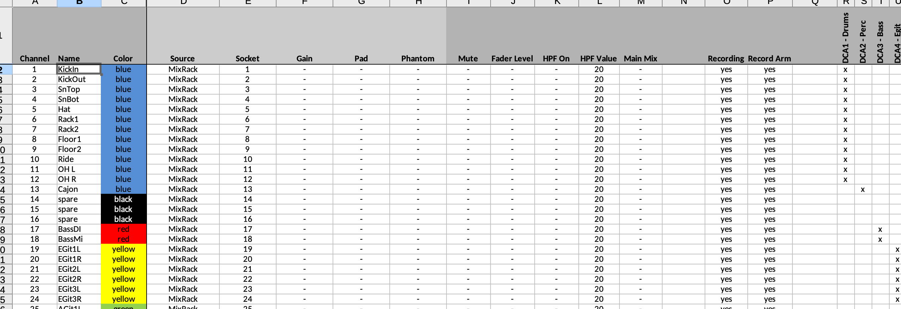
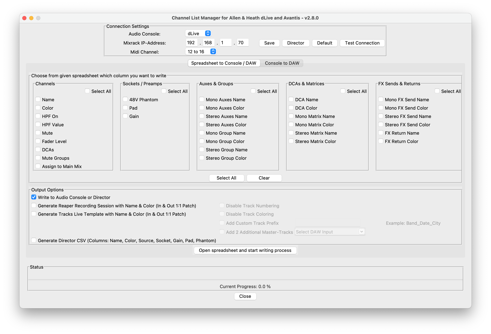
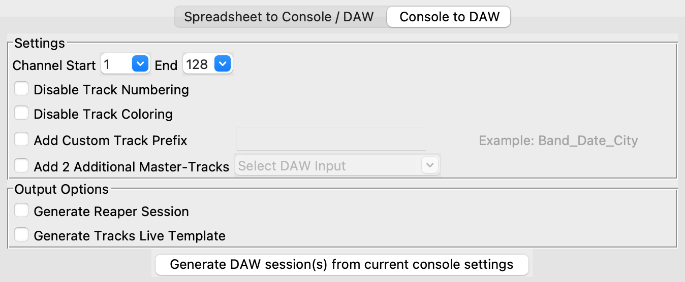

# dlive-midi-tools
## Description
Python and MIDI/TCP-based tool to prepare channel lists for Allen &amp; Heath dLive & Avantis consoles. 
Based on a spreadsheet the following parameters can be preconfigured and in very few steps be written to real 
dLive/Avantis systems or to dLive/Avantis Director via MIDI/TCP. Additionally, from the same spreadsheet, 
a DAW recording session for Reaper or Tracks Live can be generated. 
- Channel Name
- Channel Color
- Channel Mute
- Fader Level
- Main Mix Assignments
- DCA Assignments
- 48V Phantom Power (Local, DX1 & DX3, SLink) 
- PAD (Local, DX1 & DX3, SLink)
- Gain (Local, DX1 & DX3, SLink)
- DCA Name & Color
- Aux Name & Color
- Group Name & Color
- Matrices Name & Color
- FX Sends Name & Color
- FX Returns Name & Color
- Mute Group Assignments (dLive only)
- HPF On (dLive only)
- HPF Value (dLive only)

More information about future releases can be found in the [wiki](https://github.com/togrupe/dlive-midi-tools/wiki)

## Use Cases

* Single source (spreadsheet) for channel lists in single or multi-console situations
* Better overview of all channels during preparation phase
* Sync channel names and colors between consoles and DAW for virtual soundchecks
* Supports dLive & dLive Director (offline and online)
* Supports Avantis & Avantis Director (offline and online)
* Generate DAW sessions from current console settings.

## Software Liability Warning

This software is provided "as is," without warranty of any kind, express or implied, including but not limited to the warranties of merchantability, fitness for a particular purpose, and non-infringement. In no event shall the authors or copyright holders be liable for any claim, damages, or other liability, whether in an action of contract, tort, or otherwise, arising from, out of, or in connection with the software or the use or other dealings in the software.

Furthermore, this software may be subject to known or unknown bugs, errors, and vulnerabilities, which may result in unexpected behavior or security breaches. The authors or copyright holders shall not be liable for any damages or losses resulting from such bugs, errors, or vulnerabilities.

By using this software, you acknowledge and agree that you do so at your own risk and that you will be solely responsible for any damages or losses that may arise from such use.

## Used Python Libraries
* mido - Midi Library
* pandas - spreadsheet reader/writer
* reathon - Reaper Session Creator
* xlrd - supports xls format
* odfpy - supports odf format
* openpyxl - supports xlsx format
* numpy - array computing
* pyinstaller - Binary creator

see [3rd Party Licenses](ThirdParty-Licenses.txt)

## Overview

## Download
| Version | Date       | OS                             | Download                                                                                     | Release Notes | MD5 Checksum                     |
|---------|------------|--------------------------------|----------------------------------------------------------------------------------------------|---------------|----------------------------------|
| v2.7.0  |            | macOS (x86_64 - Intel)*        |                                                                                              | [Link](#v270) |                                  |                                                                                              |               |
|         |            | Windows (x86_64)               |                                                                                              |               |                                  |
| v2.6.0  | 15.12.2023 | macOS (x86_64 - Intel)*        | [Link](https://liveworks-vt.de/downloads/dlive-midi-tools/v2_6_0/dmt-v2_6_0-macos-intel.zip) | [Link](#v260) | 420ae04d475091c15cf5094f2c9c5d3a |                                                                                              |               |
|         |            | Windows (x86_64)               | [Link](https://liveworks-vt.de/downloads/dlive-midi-tools/v2_6_0/dmt-v2_6_0-windows.zip)     |               | 6e3d3adf822604d49708a434274c438f |
| v2.5.0  | 15.09.2023 | macOS (x86_64 - Intel)*        | [Link](https://liveworks-vt.de/downloads/dlive-midi-tools/v2_5_0/dmt-v2_5_0-macos.zip)       | [Link](#v250) |                                  | 
|         |            | Windows (x86_64)               | [Link](https://liveworks-vt.de/downloads/dlive-midi-tools/v2_5_0/dmt-v2_5_0-windows.zip)     |               |                                  |
| v2.4.1  | 01.08.2023 | macOS (x86_64 - Intel)*        | [Link](https://liveworks-vt.de/downloads/dlive-midi-tools/v2_4_1/dmt-v2_4_1-macos.zip)       | [Link](#v241) |                                  | 
|         |            | macOS (arm_64 - Apple Silicon) | [Link](https://liveworks-vt.de/downloads/dlive-midi-tools/v2_4_1/dmt-v2_4_1-macos-m1.zip)    |               |                                  |
|         |            | Windows (x86_64)               | [Link](https://liveworks-vt.de/downloads/dlive-midi-tools/v2_4_1/dmt-v2_4_1-windows.zip)     |               |                                  |

(*) Hints for Apple-Silicon: In combination with Rosetta also compatible for Apple-Silicon (M1/M2). Newer versions of macOS should have it installed by default. 
    Keep in mind that the first start can take a while.

Older versions see [archive](doc/download-archive.md)

## Input file / The Spreadsheet Template
An example spreadsheet file named: **dLiveChannelList.xlsx** can be found in the root folder. 
By default, channels 1-128 are available in the sheet. If you need less, 
just delete the channels you don't want to process.  

You can also write in blocks. e.g. 
* CH1-16
* CH25-32
* CH97-128

in this case, the channels not mentioned are not affected, this works as well for the  `Groups`.

Empty lines in between are **not** supported.  

Microsoft Excel and LibreOffice Calc Spreadsheet can be used to write/save the sheets.
Please make sure that you save your changes in the (*.xlsx or *.ods) format.

> **_NOTE:_**  You can add additional columns, like 'mic stand', 'mic/di', 'subcore patching' etc., but please make sure that the first line keeps the existing fields including their names, otherwise the data can´t be parsed properly. If you want you can also reorder the columns to your needs.

### Channel Overview

More details about the `Channels` columns can be found [here](doc/channels/README.md)

### Sockets Overview

More details about the `Sockets` columns can be found [here](doc/sockets/README.md)

### Groups Overview

More details about the `Groups` columns can be found [here](doc/groups/README.md)

### Mixer Config
This is a report of used busses. It does not change the "Mixer Config".   Please have a look at the yellow box.  
It can help you to set the "Mixer Config" properly.

# Example Generated Reaper Recording Session
If you select the "Generate Reaper Recording Session" checkbox, 
the columns `Name`, `Color`, `Recording`, and `Record Arm` are considered for the template generation process. 

# Example Generated Tracks Live Template ´
If you select the "Generate Tracks Live Template" checkbox, 
the columns `Name`, `Color`, `Recording`, and `Record Arm` are considered for the template generation process.

The tool generates a track live template (*.template), which can be used to create a recording session in Tracks Live

Click on `Open Template` and select the generated file.

## Settings on the console
The `Midi Channel` setting on dLive under `Utils/Shows -> Control -> Midi` should be set to: `12 to 16`, which is default.

If you want to change the preconfigured Midi port, you can change it in the Graphical User Interface according to your dLive settings. 

## Default IP-Address
The default dLive Mixrack IP-Address is: 192.168.1.70. This IP-Address is preconfigured in the scripts. If you want to 
change it, you can edit the field `ip` in the file: dliveConstants.py or during runtime within the Graphical User Interface.  

Please make sure that your Ethernet or Wi-Fi interface has an IP-Address in the same subnet. e.g. IP: 192.168.1.10 / Subnet: 255.255.255.0
 

## Usage
Prerequisites: 
* Windows >= 10 / macOS >= BigSur
* dLive Firmware: 1.9x
* Avantis Firmware: 1.30
* Microsoft Excel or LibreOffice Calc Spreadsheet
* Reaper (Optional)
* Tracks Live v1.3 (Optional)
* Python 3.11 (Optional, if you want to build the software yourself)

To run the tool, you have two options:  
A: Use an available download (see above), unzip it, start the dmt tool and continue with Step 4  
B: Build it your own from scratch, using the following steps. 

B1. Before you run the script, please run the following command to download the required Python modules using `pip`. Please make sure `pip` is installed.

`pip install -r dependencies.txt`

B2. Run the script with the following command: 

`cd src`  
`python3 Main.py`

B3. (Optional) If you want to make a binary out of it, please do the following: 

    B3.1 Installation of pyinstaller

    `pip install pyinstaller`

    B3.2 Create a onefile binary (works for Windows and macOS)

    `pyinstaller -y --onefile -w ./src/Main.py`

4. Afterwards, the following window appears. This can take a couple of seconds.

__Recommendation__: Please back up your current show file, just to be on the safe side if something goes wrong.

1. Select the console: `dLive` or `Avantis`

2. Check the (Mixrack-) IP and Midi Port. 

3. `Save` Persists the current settings (console, IP, midi-port) for the next start of the tool.

4. `Director`, sets the IP to 127.0.0.1, to use Director locally on the same machine. Director has to be started before. You can also write to a Director instance running on a different machine, in this case, please use the external IP-Address of this machine where Director is already started and running. (In case of connection issues, please check the firewall rules or disable it temporarily)

5. `Default` Sets the IP back to default: 192.168.1.70.

6. `Test Connection` Tries to establish a test connection to the console. In both cases (successful/failed) you will be informed by a pop-up.

The tool has currently to modes:
* Spreadsheet to Console / DAW (Continue with next Step)
* Console to DAW (Continue with Step 10)

Choose which mode you want to use:

7. Select the spreadsheet columns you want to write and then select `Write to Audio Console or Director`.
   
   `Select All` selects all checkboxes.
   `Clear` removes all ticks.

8. If you also want to create a DAW Session template (Reaper or Tracks Live), set the corresponding tick. The session files `<input-spreadsheet-file>-reaper-recording-template.rpp` / `<input-spreadsheet-file>-trackslive-recording.template` 
   will be generated into the directory from where the spreadsheet has been chosen. In the `Channels` tab, you can configure which channel shall be recorded and "record armed". The patching is 1:1 (derived from the channel number)   
   
   The following DAW-based options are available:  
   * Disable Track Numbering  
   * Disable Track Coloring  
   * An additional custom track prefix can also be added. 
   * Add two additional mono busses to record your mixing sum.

  
> **_NOTE:_**  You can also use the tool to create only the DAW session file (Reaper or Tracks Live), in case you use a different audio console. In this case, use the following settings (1+2a/2b) and continue with Step 9 (3).  

   

9. Click the button `Open spreadsheet and start writing process` to select the spreadsheet. Afterwards, the selected action(s) start automatically.
   
   **Recommendation:** Please test it first with the delivered spreadsheet to make sure everything works properly.

10. Console to DAW - Generates a DAW session from the current console settings. This can be triggered even later, when an existing show is available on the console. This process doesn´t need a spreadsheet. 

Options:
   * Choose `Start` and `End` channel to be used for DAW generation.
   * Disable Track Numbering  
   * Disable Track Coloring  
   * An additional custom track prefix can also be added. 
   * Add two additional mono busses to record your mixing sum.

Click `Generate DAW session(s) from current console settings`

11. If something goes wrong, please check the Python console or the `main.log`

If you find any issues, please let me know. New ideas are welcome. 

Have fun! 

## Feedback
If you want to give feedback, report an issue or contribute (new ideas, coding, testing, documentation) please use the following mail address:  
dmt@liveworks-vt.de or the following [Link](https://github.com/togrupe/dlive-midi-tools/discussions)

## Release Notes
### v2.7.0

Feature & Maintenance Release

#### New Features
- Console to DAW Recording Session

#### Improvements
- Switched to tab based GUI

#### Technical Limitations
- DX2 (Pad/Phantom/Gain) for Avantis via SLink is currently not possible due to technical limitations on API.
- HPF on, HPF value, and Mute Groups for Avantis are currently not possible due to technical limitations on API.

#### Issues fixed

#### Known issues

### v2.6.0

Feature & Maintenance Release

#### New Features
- Tracks Live Support (Template Generation)
- Possibility to disable track coloring
- Channel to Main Mix Assignments
- Bypass feature for DCAs and Mute Groups added

#### Improvements
- Support for spaces in track names for Reaper

#### Technical Limitations
- DX2 (Pad/Phantom/Gain) for Avantis via SLink is currently not possible due to technical limitations on API.
- HPF on, HPF value, and Mute Groups for Avantis are currently not possible due to technical limitations on API.

#### Issues fixed

#### Known issues

### v2.5.0

Feature & Maintenance Release

#### New Features
- Bypass feature on channels, sockets, and groups sheet added
- Possibility to disable track numbering
- Possibility to add two additional master tracks
- Possibility to add a custom track prefix

#### Improvements
- Gain value mapping improved - gain values are now more accurate.

#### Technical Limitations
- DX2 (Pad/Phantom/Gain) for Avantis via SLink is currently due to technical limitation not possible.
- HPF on, HPF value and Mute Groups for Avantis due to technical limitation currently not possible.

#### Issues fixed

#### Known issues

### v2.4.1

Maintenance Release

#### Issues fixed
- spreadsheet template formula fixed at cell AT2

#### Technical Limitations
- DX2 (Pad/Phantom/Gain) for Avantis via SLink is currently due to technical limitation not possible.
- HPF on, HPF value and Mute Groups for Avantis due to technical limitation currently not possible.

### v2.4.0

Feature & Maintenance Release

#### New Features
- DCA Name & Color
- Aux Name & Color
- Group Name & Color
- Matrices Name & Color
- FX Sends Name & Color
- FX Returns Name & Color
- Current Processing Action now shown in UI
- Test Connection Button added
- Select All Button added
- Clear Button added

#### Improvements
- HPF Value Formula improved
- Channels > 64 skipped for Avantis
- UI Error Handling improved
- Repository reorganized
- Spreadsheet improved (Mixer Config report, DCA names) 

#### Technical Limitations
- DX2 (Pad/Phantom/Gain) for Avantis via SLink is currently due to technical limitation not possible.
- HPF on, HPF value and Mute Groups for Avantis due to technical limitation currently not possible.

#### Issues fixed

#### Known issues

### v2.3.0

Feature Release

#### New Features
- Fader Level Support
- Gain Support
- DCA Support
- Mute Group Support (dLive only)
- HPF On Support (dLive only)
- HPF Value Support (dLive only)

#### Improvements
- Progress Bar improved
- Infobox for missing Avantis features added
- Checkbox Groups introduced
- Checkbox Group "Select All" added
- IP-Address Label is now dynamic
- Processing accelerated

#### Technical Limitations
- DX2 (Pad/Phantom/Gain) for Avantis via SLink is currently due to technical limitation not possible.
- HPF on, HPF value and Mute Groups for Avantis due to technical limitation currently not possible.

#### Issues fixed

#### Known issues

### v2.2.0

Feature Release

#### New Features
- Avantis support
- Director button introduced
- Save button added, to persist data
- Default button added, to set back the ip to default
- Recordable & Record Arm feature added
- Reaper template is now generated right next to the chosen spreadsheet with the same name as prefix

#### Technical Limitations
- DX2 (Pad/Phantom) for Avantis via SLink is currently due to technical limitation not possible.

#### Issues fixed
- Temporary GUI freeze fixed

#### Improvements
- Robustness improved

#### Known issues
