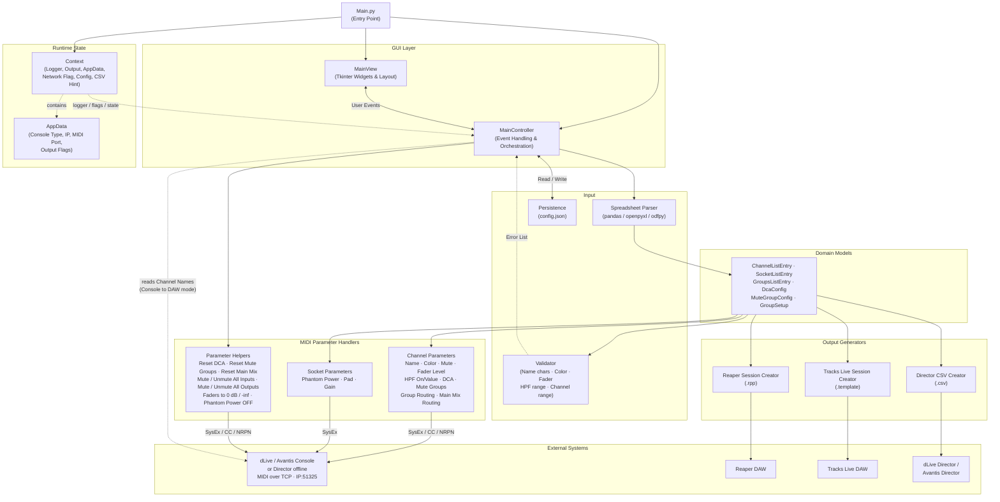

# Architecture Overview

## Component Diagram



## Module Descriptions

| Module | Path | Responsibility |
|--------|------|----------------|
| Entry Point | `src/Main.py` | Initialize context, models, view, and controller; start Tkinter event loop |
| MainView | `src/gui/MainView.py` | Tkinter GUI layout, widgets, tabs, checkboxes, progress bars |
| MainController | `src/gui/MainController.py` | Event handlers, threading for long operations, business logic orchestration |
| AppData | `src/AppData.py` | Runtime state: console type, IP address, MIDI channel, output flags |
| Context | `src/Context.py` | Global context passed throughout: logger, MIDI output, AppData reference, network flag, config path, CSV hint flag |
| Domain Models | `src/model/` | Typed data containers for channel, socket, group, and DCA configurations |
| Spreadsheet | `src/spreadsheet/Spreadsheet.py` | Parse `.xlsx` / `.ods` templates into model objects via pandas |
| Validator | `src/spreadsheet/Validator.py` | Validate parsed models: allowed name characters, color values, fader levels, HPF range, channel range, yes/no fields |
| Channel Params | `src/parameters/channels/` | Generate SysEx, CC, and NRPN MIDI messages for channel parameters |
| Socket Params | `src/parameters/sockets/` | Generate SysEx MIDI messages for socket/preamp parameters |
| Parameter Helpers | `src/parameters/channels/Helpers.py` | Bulk console operations: reset all DCA/Mute Group/Main Mix assignments, mute/unmute all inputs/outputs, set all input faders to 0 dB or -inf, phantom power off for all sockets |
| Reaper Creator | `src/dawsession/ReaperSessionCreator.py` | Generate Reaper `.rpp` recording session files |
| Tracks Live Creator | `src/dawsession/TracksLiveSessionCreator.py` | Generate Tracks Live `.template` session files |
| CSV Creator | `src/directorcsv/CsvCreator.py` | Generate Director-compatible CSV exports |
| Persistence | `src/persistence/Persistence.py` | Read/write `config.json` for user settings between sessions |
| Helper | `src/helper/Networking.py` | IP address validation utilities |

## Data Flow

### Spreadsheet → Console / Director

```
Spreadsheet (.xlsx/.ods)
    → Spreadsheet Parser (pandas)
    → Data Models (ChannelListEntry, SocketListEntry, GroupsListEntry)
    → Validator (name chars, colors, fader levels, HPF range, channel range)
        ↳ Errors → shown to user; processing stops
        ↳ Valid  → continue
    → Parameter Handlers (generate MIDI messages)
    → mido Library
    → Console / Director (MIDI over TCP)
```

### Spreadsheet → DAW Session

```
Spreadsheet (.xlsx/.ods)
    → Spreadsheet Parser
    → Data Models
    → Reaper / Tracks Live Session Creator
    → .rpp / .template file
```

### Spreadsheet → Director CSV

```
Spreadsheet (.xlsx/.ods)
    → Spreadsheet Parser
    → Data Models
    → Director CSV Creator
    → .csv file → Director CSV Import
```

### Console → DAW Session

```
Console (MIDI over TCP)
    → MainController (reads channel names via MIDI)
    → Data Models
    → Reaper / Tracks Live Session Creator
    → .rpp / .template file
```

### Utilities Tab → Console

```
User (Utilities tab button)
    → MainController (threaded)
    → Parameter Helpers:
        Reset:   reset_all_dca / reset_all_mute_groups / reset_all_main_mix
        Mute:    mute_all_inputs / mute_all_outputs
        Unmute:  unmute_all_inputs / unmute_all_outputs
        Fader:   set_all_input_faders_to_zero / set_all_input_faders_to_minus_inf
        Preamp:  phantom_power_off_all_sockets
    → MIDI messages (SysEx / CC / NRPN / Note)
    → Console (MIDI over TCP)
```

## MIDI Protocol

| Parameter | MIDI Message Type | Notes |
|-----------|-------------------|-------|
| Channel Name | SysEx | Allen & Heath proprietary |
| Channel Color | SysEx | Allen & Heath proprietary |
| Phantom Power | SysEx | Allen & Heath proprietary |
| Pad | SysEx | Allen & Heath proprietary |
| Gain | SysEx | Allen & Heath proprietary |
| Fader Level | NRPN | Non-Registered Parameter Number |
| HPF On / Value | NRPN | dLive only |
| DCA Assignment | NRPN | |
| Mute Group Assignment | NRPN | dLive only |
| Group / Aux Routing | NRPN | |
| Main Mix Routing | NRPN | |
| Mute | Control Change | |

## Console Support Matrix

| Feature | dLive | Avantis |
|---------|-------|---------|
| Max Channels | 128 | 64 |
| Name & Color | Yes | Yes |
| Phantom / Pad / Gain (Local) | Yes | Yes |
| Phantom / Pad / Gain (DX1/DX3) | Yes | Yes |
| Phantom / Pad / Gain (SLink/DX2) | Yes | No (API limitation) |
| Fader Level | Yes | Yes |
| Mute | Yes | Yes |
| HPF On / Value | Yes | No (API limitation) |
| DCA Assignments | Yes | Yes |
| Mute Group Assignments | Yes | No (API limitation) |
| Group Routing | Yes | No (API limitation) |
| Main Mix Routing | Yes | Yes |