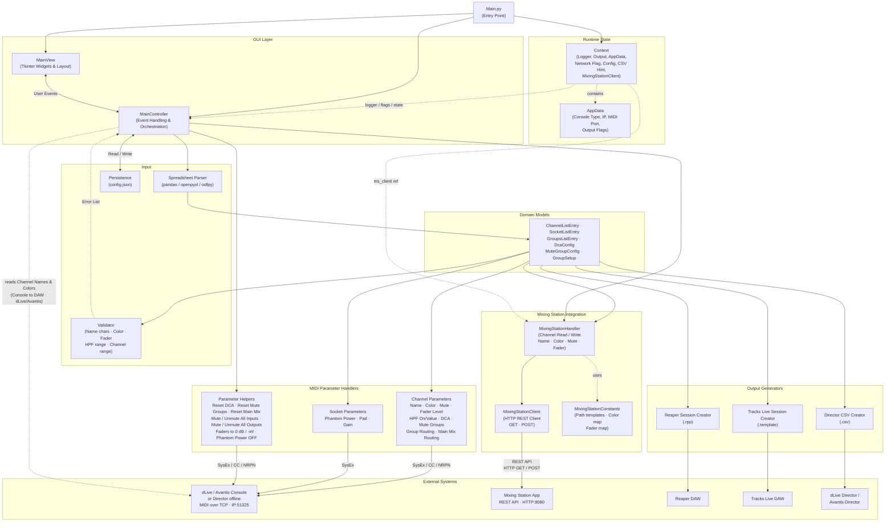

# Architecture Overview

## Component Diagram



## Module Descriptions

| Module | Path | Responsibility |
|--------|------|----------------|
| Entry Point | `src/Main.py` | Initialize context, models, view, and controller; start Tkinter event loop |
| MainView | `src/gui/MainView.py` | Tkinter GUI layout, widgets, tabs, checkboxes, progress bars |
| MainController | `src/gui/MainController.py` | Event handlers, threading for long operations, business logic orchestration |
| AppData | `src/AppData.py` | Runtime state: console type, IP address, MIDI channel, output flags |
| Context | `src/Context.py` | Global context passed throughout: logger, MIDI output, AppData reference, network flag, config path, CSV hint flag, MixingStationClient reference |
| Domain Models | `src/model/` | Typed data containers for channel, socket, group, and DCA configurations |
| Spreadsheet | `src/spreadsheet/Spreadsheet.py` | Parse `.xlsx` / `.ods` templates into model objects via pandas |
| Validator | `src/spreadsheet/Validator.py` | Validate parsed models: allowed name characters, color values, fader levels, HPF range, channel range, yes/no fields |
| Channel Params | `src/parameters/channels/` | Generate SysEx, CC, and NRPN MIDI messages for channel parameters |
| Socket Params | `src/parameters/sockets/` | Generate SysEx MIDI messages for socket/preamp parameters |
| Parameter Helpers | `src/parameters/channels/Helpers.py` | Bulk console operations: reset all DCA/Mute Group/Main Mix assignments, mute/unmute all inputs/outputs, set all input faders to 0 dB or -inf, phantom power off for all sockets |
| MS Client | `src/mixingstation/MixingStationClient.py` | Thin HTTP REST client for the Mixing Station app: `get(path)` and `set(path, value)` over `http://{host}:{port}` |
| MS Handler | `src/mixingstation/MixingStationHandler.py` | Channel read (`get_channel_data`) and write helpers (name, color, mute, fader level) using the REST client |
| MS Constants | `src/mixingstation/MixingStationConstants.py` | REST path templates, color integer ↔ spreadsheet string maps, fader dB map, default port |
| Reaper Creator | `src/dawsession/ReaperSessionCreator.py` | Generate Reaper `.rpp` recording session files |
| Tracks Live Creator | `src/dawsession/TracksLiveSessionCreator.py` | Generate Tracks Live `.template` session files |
| CSV Creator | `src/directorcsv/CsvCreator.py` | Generate Director-compatible CSV exports |
| PDF Exporter | `src/export/PdfExporter.py` | Generate a formatted channel-list PDF using fpdf2; `open_file()` sends it to the OS default PDF viewer for printing |
| JSON Exporter | `src/export/JsonExporter.py` | Generate a `dante-config-editor-channel-labels` JSON file, compatible with [Dante Config Editor V3](https://github.com/Mamat79/DanteConfigEditorV3) by Mamat79 |
| CSV Exporter | `src/export/CsvExporter.py` | Generate the equivalent Dante Config Editor CSV format (`format_version,source_app,source_version,device,direction,channel,dante_id,label`) |
| Persistence | `src/persistence/Persistence.py` | Read/write `config.json` for user settings between sessions |
| Helper | `src/helper/Networking.py` | IP address validation utilities |

## Data Flow

### Spreadsheet → Console / Director (dLive / Avantis)

```
Spreadsheet (.xlsx/.ods)
    → Spreadsheet Parser (pandas)
    → Data Models (ChannelListEntry, SocketListEntry, GroupsListEntry)
    → Validator (name chars, colors, fader levels, HPF range, channel range)
        ↳ Errors → shown to user; processing stops
        ↳ Valid  → continue
    → Parameter Handlers (generate MIDI messages)
    → mido Library
    → Console / Director (MIDI over TCP)
```

### Spreadsheet → Mixing Station

```
Spreadsheet (.xlsx/.ods)
    → Spreadsheet Parser (pandas)
    → Data Models (ChannelListEntry)
    → Validator
    → MixingStationHandler (name / color / mute / fader level)
    → MixingStationClient
    → Mixing Station App (HTTP POST /console/data/set/…)
```

### Spreadsheet → DAW Session

```
Spreadsheet (.xlsx/.ods)
    → Spreadsheet Parser
    → Data Models
    → Reaper / Tracks Live Session Creator
    → .rpp / .template file
```

### Spreadsheet → Director CSV

```
Spreadsheet (.xlsx/.ods)
    → Spreadsheet Parser
    → Data Models
    → Director CSV Creator
    → .csv file → Director CSV Import
```

### Console → DAW Session (dLive / Avantis)

```
Console (MIDI over TCP)
    → Color.get_color_channel  (SysEx GET per channel)
    → Name.get_name_channel    (SysEx GET per channel)
    → Data Models (ChannelListEntry)
    → Reaper / Tracks Live Session Creator
    → .rpp / .template file
```

### Console → DAW Session (Mixing Station)

```
Mixing Station App (HTTP REST API · port 8080)
    → MixingStationClient.get(ch.N.cfg.color)  (per channel)
    → MixingStationClient.get(ch.N.cfg.name)   (per channel)
    → MixingStationHandler.get_channel_data
    → Data Models (ChannelListEntry)
    → Reaper / Tracks Live Session Creator
    → .rpp / .template file
```

### Console → PDF (dLive / Avantis)

```
Console (MIDI over TCP)
    → Color.get_color_channel  (SysEx GET per channel)
    → Name.get_name_channel    (SysEx GET per channel)
    → PdfExporter.export_pdf   (channel list as table, color cells)
    → .pdf file  →  save to disk  or  open in system PDF viewer (Print)
```

### Console → PDF (Mixing Station)

```
Mixing Station App (HTTP REST API · port 8080)
    → MixingStationHandler.get_channel_data  (name · color per channel)
    → PdfExporter.export_pdf   (channel list as table, color cells)
    → .pdf file  →  save to disk  or  open in system PDF viewer (Print)
```

### Export Tab → JSON / CSV (Console / Mixing Station source)

```
Console (MIDI over TCP) or Mixing Station App (HTTP REST API · port 8080)
    → Color.get_color_channel + Name.get_name_channel   (dLive / Avantis)
      or MixingStationHandler.get_channel_data          (Mixing Station)
    → JsonExporter.export_json  or  CsvExporter.export_csv
    → .json / .csv file  →  Dante Config Editor import
```

### Export Tab → JSON / CSV (Spreadsheet source)

```
Spreadsheet (.xlsx)
    → Spreadsheet Parser (pandas) — Channels sheet only
    → Data Models (ChannelListEntry)
    → JsonExporter.export_json  or  CsvExporter.export_csv
    → .json / .csv file  →  Dante Config Editor import
```

> No console or Mixing Station connection is required for the spreadsheet source.

### Utilities Tab → Console

```
User (Utilities tab button)
    → MainController (threaded)
    → Parameter Helpers:
        Reset:   reset_all_dca / reset_all_mute_groups / reset_all_main_mix
        Mute:    mute_all_inputs / mute_all_outputs
        Unmute:  unmute_all_inputs / unmute_all_outputs
        Fader:   set_all_input_faders_to_zero / set_all_input_faders_to_minus_inf
        Preamp:  phantom_power_off_all_sockets
    → MIDI messages (SysEx / CC / NRPN / Note)
    → Console (MIDI over TCP)
```

> Utilities are not available for Mixing Station (buttons disabled when Mixing Station is selected).

## MIDI Protocol (dLive / Avantis)

| Parameter | MIDI Message Type | Notes |
|-----------|-------------------|-------|
| Channel Name | SysEx | Allen & Heath proprietary |
| Channel Color | SysEx | Allen & Heath proprietary |
| Phantom Power | SysEx | Allen & Heath proprietary |
| Pad | SysEx | Allen & Heath proprietary |
| Gain | SysEx | Allen & Heath proprietary |
| Fader Level | NRPN | Non-Registered Parameter Number |
| HPF On / Value | NRPN | dLive only |
| DCA Assignment | NRPN | |
| Mute Group Assignment | NRPN | dLive only |
| Group / Aux Routing | NRPN | |
| Main Mix Routing | NRPN | |
| Mute | Control Change | |

## Mixing Station REST API

Mixing Station is a third-party app that runs on Android, iOS, macOS, or Windows and
connects to a physical console over the local network. It exposes an HTTP REST API that
dmt uses as an alternative transport layer — instead of sending MIDI over TCP directly to
the console, dmt sends HTTP requests to Mixing Station, which forwards the changes to the
connected hardware.

This approach is used for consoles that are not natively supported by dmt's MIDI layer
(SQ, DM7, Wing, M32/X32, QU). The Mixing Station app must be running, connected to the
console, and have the HTTP REST API enabled before dmt can communicate with it.

Default port: **8080**. Channel indices are 0-based in all paths.

| Operation | Method | Path pattern | Notes |
|-----------|--------|-------------|-------|
| Get channel name | GET | `/console/data/get/ch.{N}.cfg.name/val` | 0-based channel index |
| Get channel color | GET | `/console/data/get/ch.{N}.cfg.color/val` | Returns float; console-specific integer |
| Set channel name | POST | `/console/data/set/ch.{N}.cfg.name/val` | Max 6 characters |
| Set channel color | POST | `/console/data/set/ch.{N}.cfg.color/val` | Console-specific integer (see color maps) |
| Set fader level | POST | `/console/data/set/ch.{N}.mix.lvl/val` | Float dB value |
| Set mute | POST | `/console/data/set/ch.{N}.mix.on/val` | Bool: `true` = unmuted |
| Test connection | GET | `/app/state` | Used by Test Connection button |

### Color Maps

Color IDs are console-specific. The tool selects the correct map based on the console type chosen in the UI.

#### SQ

| ID | Color | Spreadsheet value |
|----|-------|-------------------|
| 0 | Black | black |
| 1 | Red | red |
| 2 | Green | green |
| 3 | Blue | blue |
| 4 | Cyan | light blue |
| 5 | Yellow | yellow |
| 6 | Magenta | purple |
| 7 | White | white |

#### DM7

| ID | Color | Spreadsheet value |
|----|-------|-------------------|
| 0 | Purple | purple |
| 2 | Red | red |
| 4 | Yellow | yellow |
| 5 | Blue | blue |
| 6 | Cyan | light blue |
| 7 | Green | green |
| 10 | White | white |
| 11 | Black | black |

#### Wing

| ID | Color | Spreadsheet value |
|----|-------|-------------------|
| 0 | Blue | blue |
| 1 | Light Blue | light blue |
| 4 | Green | green |
| 6 | Yellow | yellow |
| 7 | Brown / Black | black |
| 8 | Red | red |
| 10 | Purple | purple |

#### M32 / X32

| ID | Color | Spreadsheet value |
|----|-------|-------------------|
| 0 | Black | black |
| 1 | Red | red |
| 2 | Green | green |
| 3 | Yellow | yellow |
| 4 | Blue | blue |
| 5 | Magenta | purple |
| 6 | Cyan | light blue |
| 7 | White | white |

IDs 8–15 are inverted variants of 0–7 (same spreadsheet colors on read-back).

#### QU

| ID | Color | Spreadsheet value |
|----|-------|-------------------|
| 1 | Yellow | yellow |
| 2 | Red | red |
| 3 | Green | green |
| 4 | Blue | blue |
| 6 | Purple | purple |
| 8 | White | white |

## Console Support Matrix

Mixing Station acts as a bridge between dmt and the physical console. The console sub-type
(SQ / DM7 / Wing / M32/X32 / QU) is selected separately in the UI and only affects the
color mapping used for REST API calls.

| Feature | dLive | Avantis | Mixing Station |
|---------|-------|---------|----------------|
| Supported sub-types | — | — | SQ · DM7 · Wing · M32/X32 · QU |
| Max Channels | 128 | 64 | 99 |
| Name & Color | Yes | Yes | Yes |
| Mute | Yes | Yes | Yes |
| Fader Level | Yes | Yes | Yes |
| Console to DAW (read name + color) | Yes | Yes | Yes |
| Export / Print as PDF | Yes | Yes | Yes |
| Export as JSON / CSV (Dante Labels) | Yes | Yes | Yes |
| Phantom / Pad / Gain (Local) | Yes | Yes | No |
| Phantom / Pad / Gain (DX1/DX3) | Yes | Yes | No |
| Phantom / Pad / Gain (SLink/DX2) | Yes | No | No |
| HPF On / Value | Yes | No | No |
| DCA Assignments | Yes | Yes | No |
| Mute Group Assignments | Yes | No | No |
| Group Routing | Yes | No | No |
| Main Mix Routing | Yes | Yes | No |
| Utilities Tab | Yes | Yes | No |
