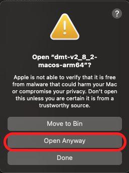
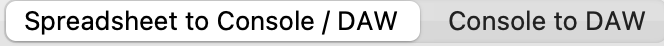
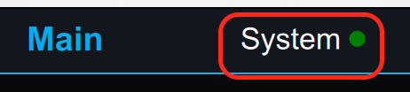
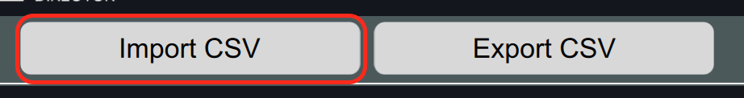
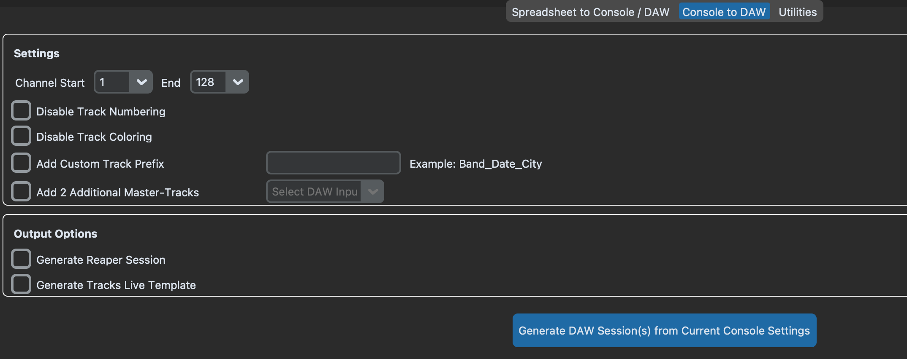
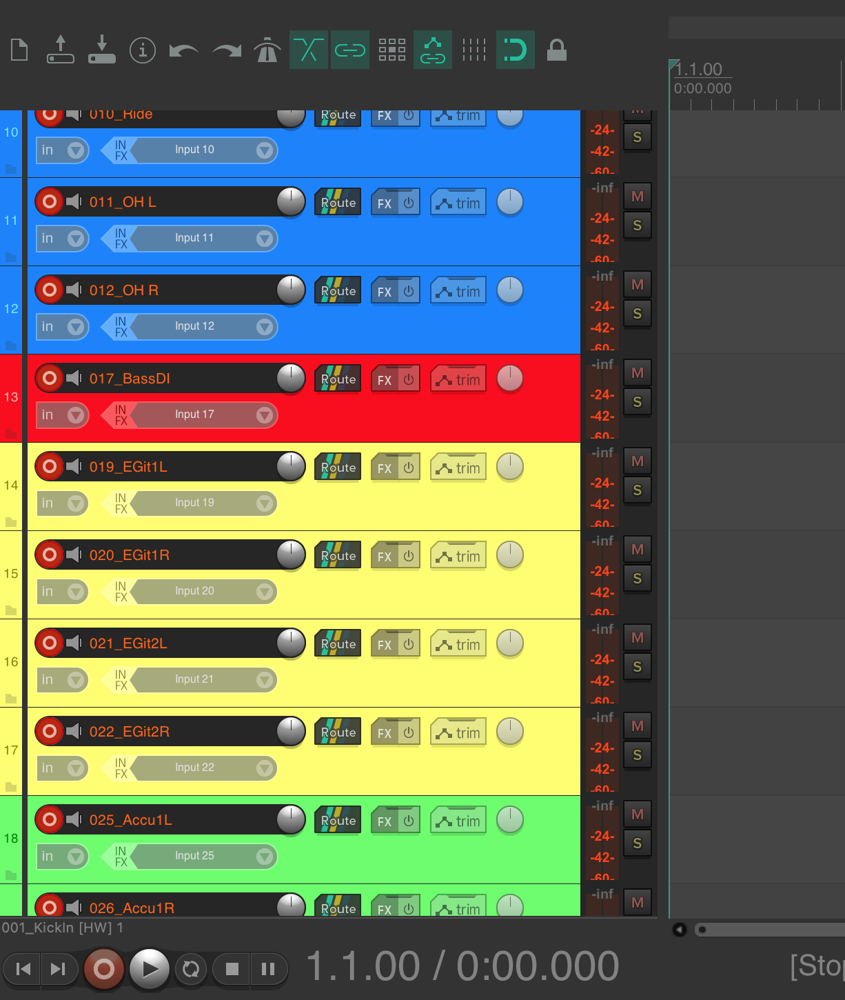
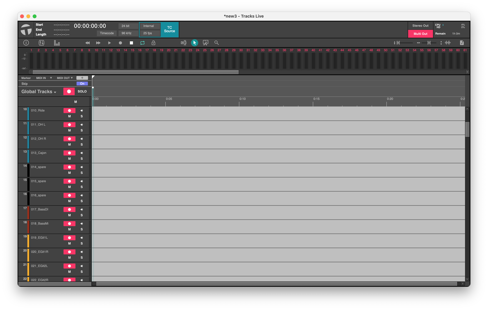
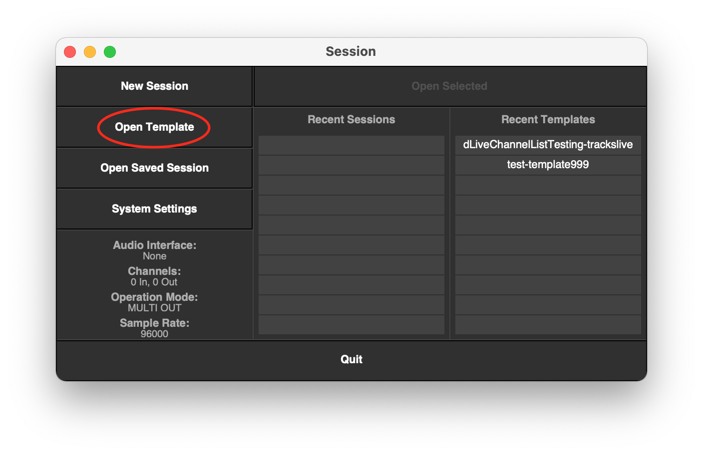

# Usage Guide

## Prerequisites

* Windows >= 10 / macOS >= Monterey / Linux (not officially tested — build from source)
* dLive Firmware: 1.9x / 2.x
* dLive Director: 1.9x / 2.x (Optional)
* Avantis Firmware: 1.3x
* Mixing Station (Android / iOS / Desktop) with REST API enabled, port 8080 (Optional)
* Microsoft Excel (ideally Office 365) or LibreOffice Calc Spreadsheet (>25.x.x)
* Reaper >= v6.x (Optional)
* Tracks Live v1.3 (Optional)
* Python 3.12 (Optional, if you want to build the software yourself)

## Running the Tool

To run the tool, you have two options:

**A: Use a pre-built release**

Download the latest release (see [README download table](../README.md#download)), unzip it, and start the `dmt` executable. If the tool does not start automatically, try "Open with → Terminal" or run it from the terminal.

If you see the following message:


Go to System Preferences → Privacy and Security → Security → Open Anyway


Enter your password and click:



Continue with [Step 4](#step-4--launch).

**B: Build from source**

B1. Install required Python modules:

```
pip install -r requirements.txt
```

B2. Run the script:

```
cd src
python3 Main.py
```

B3. *(Optional)* Create a binary:

B3.1 Install PyInstaller:

```
pip install pyinstaller
```

B3.2 Create a one-file binary (works for Windows and macOS):

```
pyinstaller -y --onefile -w ./src/Main.py
```

## Step 4 — Launch

The following window appears after launch. This can take a couple of seconds.


> **Recommendation:** Please back up your current show file before proceeding.

> **_Recommended Workflow:_** If socket patching is to be performed, first export to CSV and import into Director. This establishes the channel naming baseline for further MIDI-based data processing.

## Menu Bar

The menu bar at the top of the window provides the following options:

**Settings**
- `Dark Mode` — toggles between dark and light appearance. The selected mode is persisted across restarts.

**Help**
- `Documentation` — opens the online documentation in your browser
- `Donate ☕` — opens the donation page
- `About` — shows version information
- `Close` — exits the application

## Console Selection & Connection Settings

1. Select the console: `dLive`, `Avantis`, or `Mixing Station`

2. Check the IP address. For dLive / Avantis also check the MIDI Port. For Mixing Station, select the console type (SQ, DM7, Wing, M32/X32, QU), then enter the host IP and port (default: 8080). See [How-To: Mixing Station Integration](howto-mixing-station.md) for a step-by-step guide.

3. `Save` — persists the current settings (console, IP, MIDI port) for the next start of the tool.

4. `Director` — sets the IP to 127.0.0.1 to use Director locally on the same machine. Director must be started first. You can also write to a Director instance on a different machine by entering its IP address. (If you have connection issues, check the firewall rules or disable it temporarily.)

5. `Default` — sets the IP back to the default: 192.168.1.70.

6. `Test Connection` — tries to establish a test connection to the console. You will be informed by a pop-up in both cases (successful / failed).

## Console Settings (Mixing Station)

For a full step-by-step guide on setting up and using Mixing Station with dmt, see:

**→ [How-To: Mixing Station Integration](howto-mixing-station.md)**

## Console Settings (dLive / Avantis)

The `MIDI Channel` setting on dLive under `Utils/Shows → Control → MIDI` should be set to `12 to 16`, which is the default.

If you want to change the preconfigured MIDI port, you can change it in the GUI according to your dLive settings.

## Default IP Address

The default dLive Mixrack IP address is `192.168.1.70`, preconfigured in the tool. You can change it in the `ip` field in `dliveConstants.py` or at runtime in the GUI.

Make sure your network interface has an IP address in the same subnet, e.g. IP: `192.168.1.10` / Subnet: `255.255.255.0`

## Operating Modes

The tool has the following modes — choose which one you want to use:

* **Spreadsheet to Console / DAW** — reads from a spreadsheet and writes to a console or DAW session.
* **Console to DAW** — reads from the console and writes a DAW session.
* **Utilities** — direct console operations without a spreadsheet.
* **Export** — writes the channel list to a Dante Config Editor compatible JSON or CSV file.



## Spreadsheet to Console / DAW

7. Select the spreadsheet columns you want to write and then select `Write to Audio Console or Director`.

   `Select All` and `Clear` select or deselect all checkboxes.

8. If you also want to create a DAW session template (Reaper or Tracks Live), set the corresponding tick. The session files `<input-spreadsheet-file>-reaper-recording-template.rpp` / `<input-spreadsheet-file>-trackslive-recording.template` will be generated into the same directory as the spreadsheet. In the `Channels` tab you can configure which channels shall be recorded and record-armed. Patching is 1:1 (derived from the channel number).

   The following DAW-based options are available:
   * Disable Track Numbering
   * Disable Track Coloring
   * An additional custom track prefix can be added.
   * Add two additional mono busses to record your mix sum.

> **_NOTE:_** You can also use the tool to create only the DAW session file (Reaper or Tracks Live) without a console connection. In this case, disable "Write to Audio Console or Director", choose your DAW, and continue with Step 11.

9. `Generate Director CSV (Columns: Name, Color, Source, Socket, Gain, Pad, Phantom)` — generates a CSV file for Director including Name, Color, Patching, Gain, Pad, Phantom. This can be used as a baseline for MIDI-based parameters.





> **_NOTE:_** This feature uses the columns Name, Color, Source, Socket, Gain, Pad, Phantom from the `Channels` tab.

10. Click `Open Spreadsheet and Start Writing Process` to select the spreadsheet. The selected action(s) start automatically.

   Before processing, the tool automatically validates the spreadsheet. The validator checks:
   - Channel and group **names** for invalid characters
   - **Colors** against the supported color list
   - **Fader levels** against the supported value list
   - **HPF values** for valid range
   - **Channel numbers** against the console's maximum (128 for dLive, 64 for Avantis)
   - **Source field** values per console type (dLive / Avantis)
   - **Mute**, **HPF On**, **DCA**, **Mute Group**, **Group Routing** toggle values
   - **Phantom**, **Pad**, and **Gain** values in the Sockets tab

   If any validation errors are found, a summary is shown and processing is aborted.

   **Recommendation:** Test it first with the delivered spreadsheet to make sure everything works properly.

## Console to DAW

11. Generates a DAW session from the current console or Mixing Station settings. This can be triggered at any time when an existing show is loaded. No spreadsheet is required.

The generated files `current-console-reaper-recording-template.rpp` (Reaper) / `current-console-trackslive-recording.template` (Tracks Live) are created in the folder you choose.

The source is determined automatically from the console selection in Connection Settings:
* **dLive / Avantis** — channel names and colors are read via MIDI/TCP (SysEx)
* **Mixing Station** — channel names and colors are read via REST API (`GET /console/data/get/ch.N.cfg.name|color/val`); channel range is limited to 1–99



Options:
   * Choose `Start` and `End` channel for DAW generation.
   * Disable Track Numbering
   * Disable Track Coloring
   * An additional custom track prefix can be added.
   * Add two additional mono busses to record your mix sum.

Click `Generate DAW Session(s) from Current Console Settings`.

## Print / Export Channel List as PDF

12. Available in the **Utilities** tab. Reads the current channel list directly from the console or Mixing Station and produces a formatted PDF — no spreadsheet required.

   | Button | Behaviour |
   |--------|-----------|
   | `Export Channel List as PDF` | Asks for a save location and writes a PDF file |
   | `Print Channel List` | Generates a PDF to a temporary file and opens it in the system's default PDF viewer for printing |

   The channel range (Start / End) configured in the Console to DAW tab applies to both buttons.

   **Columns in the PDF:**

   | Column | dLive / Avantis | Mixing Station |
   |--------|-----------------|----------------|
   | Ch | Yes | Yes |
   | Name | Yes | Yes |
   | Color | Yes — colored cell | Yes — colored cell |

## Utilities

13. The `Utilities` tab provides direct console operations without requiring a spreadsheet. IP address, MIDI port, and console type from the connection settings apply here as well.

> **_NOTE:_** Utilities are not available when Mixing Station is selected — all buttons are disabled in that case.

### Reset

| Button | Description | Console Support |
|--------|-------------|-----------------|
| RESET all DCA Assignments | Removes all DCA assignments from every channel | dLive & Avantis |
| RESET all Mute Group Assignments | Removes all Mute Group assignments from every channel | dLive only |
| RESET all Main Assignments | Removes all Main Mix assignments from every channel | dLive & Avantis |

### Mute

| Button | Description | Console Support |
|--------|-------------|-----------------|
| MUTE all Inputs | Mutes all input channels | dLive & Avantis |
| MUTE all Outputs | Mutes all output channels (Aux, Groups, Matrices, FX Sends/Returns, UFX Sends/Returns) | dLive & Avantis |
| UNMUTE all Inputs | Unmutes all input channels | dLive & Avantis |
| UNMUTE all Outputs | Unmutes all output channels (Aux, Groups, Matrices, FX Sends/Returns, UFX Sends/Returns) | dLive & Avantis |

> **_NOTE:_** `RESET all Mute Group Assignments` is disabled when Avantis is selected, as Mute Groups are not available on that console.

### Fader

| Button | Description | Console Support |
|--------|-------------|-----------------|
| Set all Input Faders to 0 dB | Sets all input channel faders to unity gain (0 dB) — useful as a soundcheck starting point | dLive & Avantis |
| Set all Input Faders to -inf | Sets all input channel faders to minimum (-inf) — useful for a silent start | dLive & Avantis |

### Preamp Safety

| Button | Description | Console Support |
|--------|-------------|-----------------|
| Phantom Power OFF (all Sockets) | Switches 48V phantom power off on all sockets (Local, DX1, DX3 for dLive; Local, SLink for Avantis) — use before changing microphones | dLive & Avantis |

## Export Channel List as JSON / CSV

14. Available in the **Export** tab. Writes the channel list to a file format compatible with [Dante Config Editor V3](https://github.com/Mamat79/DanteConfigEditorV3) by Mamat79, so channel labels can be imported directly into Dante Config Editor for Dante routing/naming.

   | Button | Behaviour |
   |--------|-----------|
   | `Export Channel List as JSON (Dante Config Editor Labels)` | Asks for a save location and writes a `.json` file in the `dante-config-editor-channel-labels` format |
   | `Export Channel List as CSV (Dante Config Editor Labels)` | Asks for a save location and writes a `.csv` file with columns `format_version, source_app, source_version, device, direction, channel, dante_id, label` |

   Choose the **Channel Start / End** range, then pick where the channel names should be read from:

   | Source | Behaviour |
   |--------|-----------|
   | `Console / Mixing Station` | Reads the current channel list live from the connected console or Mixing Station — no spreadsheet required |
   | `DMT Spreadsheet` | Prompts for a dmt Channel List spreadsheet (`.xlsx`) and reads the channel names from its `Channels` sheet — no console connection required |

   The `device` field in the exported file is taken from the currently selected console / Mixing Station type.

## DAW Recording Sessions

### Reaper

If you select the "Generate Reaper Recording Session" checkbox, the columns `Name`, `Color`, `Recording`, and `Record Arm` are considered for the template generation process.



### Tracks Live

If you select the "Generate Tracks Live Template" checkbox, the columns `Name`, `Color`, `Recording`, and `Record Arm` are considered for the template generation process.



The tool generates a Tracks Live template (`*.template`), which can be used to create a recording session in Tracks Live.



Click on `Open Template` and select the generated file.

## Logs

15. If something goes wrong, please check the Python console or the `main.log`
