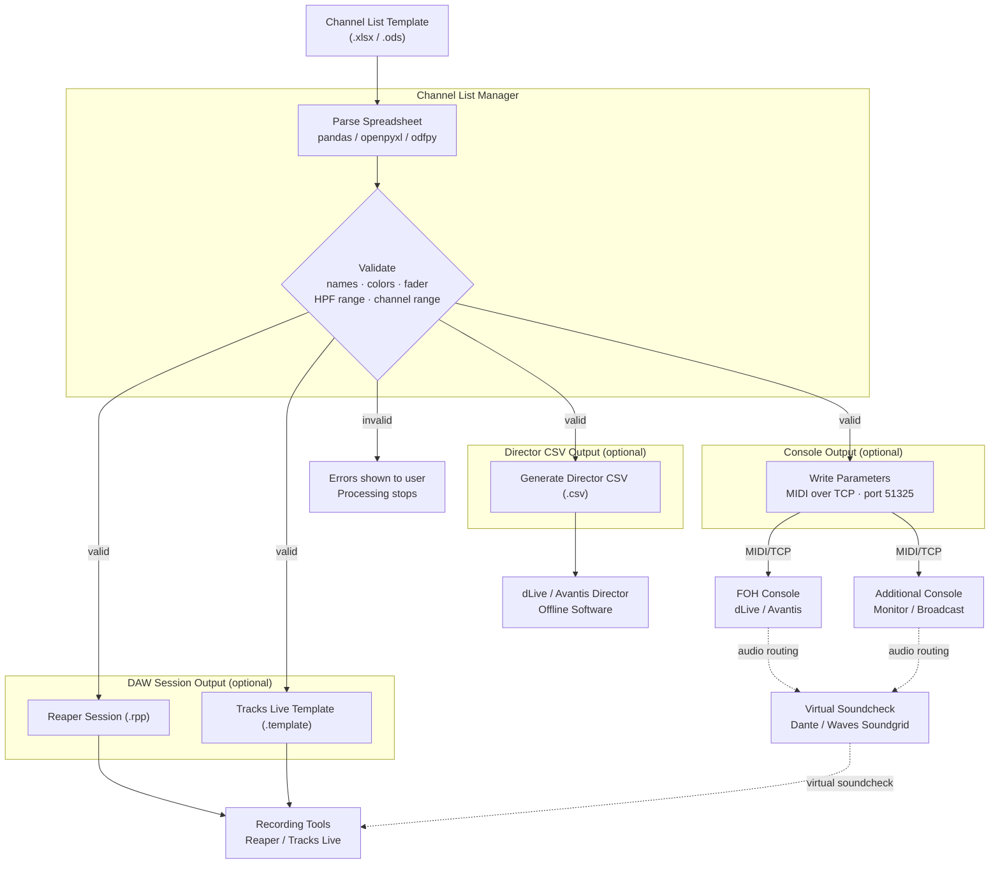
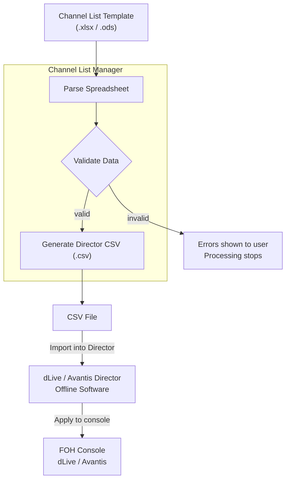
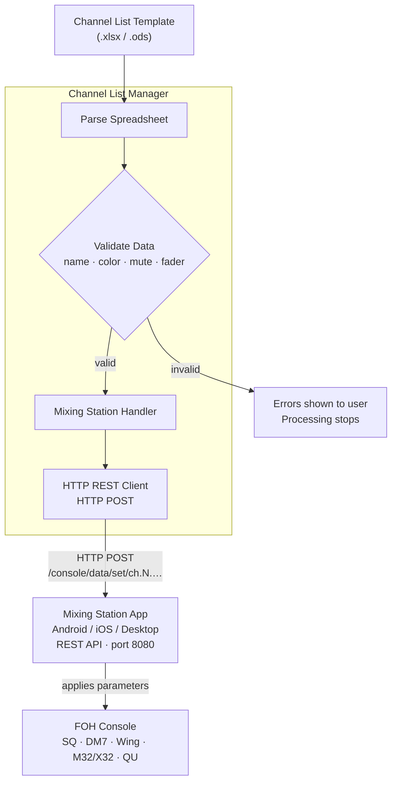
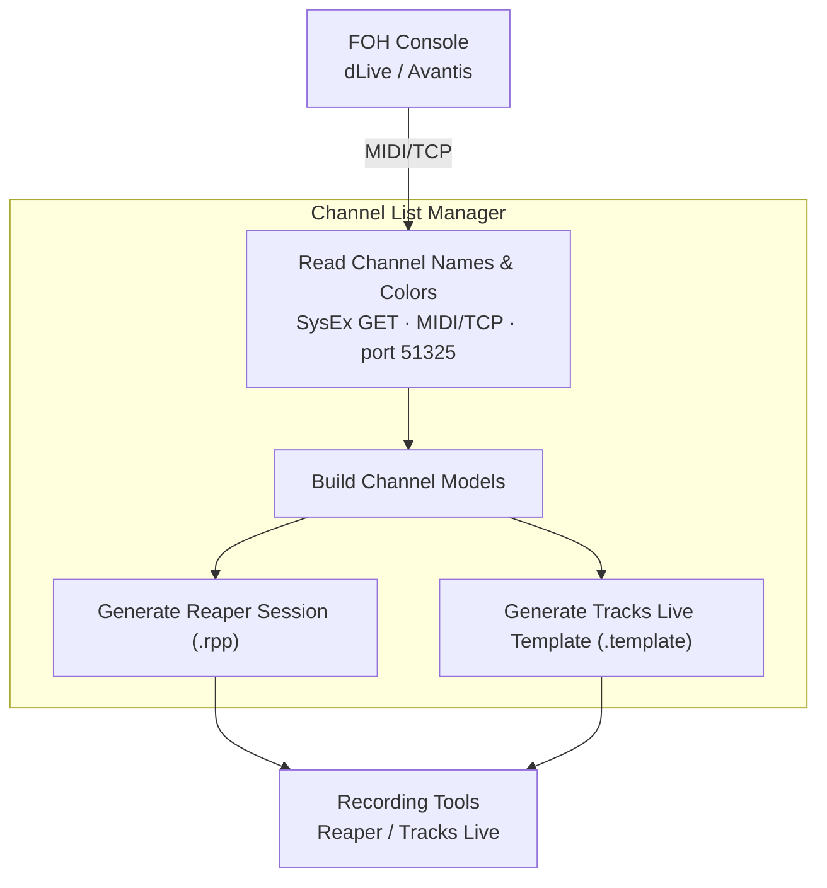
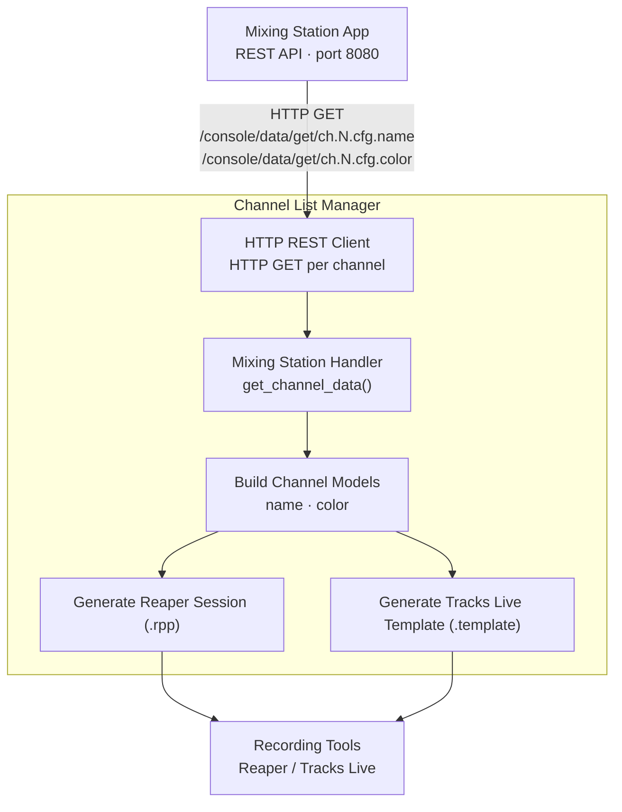
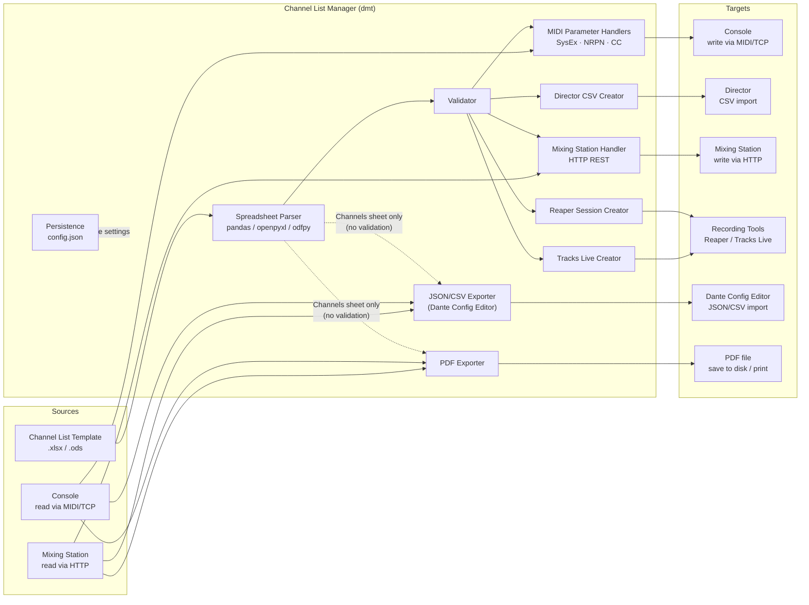

# Workflows & Overview

This document describes the five main workflows supported by **dLive MIDI Tools (dmt)**.
All workflows share the central **Channel List Manager** tool and connect to one or more
external targets (console, Director, Mixing Station, DAW).

The original full overview diagram is available as `doc/overview.drawio.svg` /
`doc/overview.drawio.png`.

---

## Workflow A – Spreadsheet → Console / DAW (dLive / Avantis)

Apply channel list data directly to a connected dLive or Avantis console via MIDI over TCP.
Optionally generate DAW recording session files in the same run.

### Step Sequence

| Step | Action |
|------|--------|
| A1 | Open Channel List Template (.xlsx / .ods) on PC / Mac |
| A2 | *(Optional)* Pre-configure names in dLive / Avantis Director offline first |
| A3 | Channel List Manager parses the spreadsheet |
| A4 | Validator checks names, colors, fader levels, HPF values, channel range |
| A5a | Write channel parameters to FOH console via MIDI/TCP |
| A5b | *(Optional)* Write to additional console (Monitor / Broadcast) |
| A6a | *(Optional)* Generate Reaper recording session (.rpp) |
| A6b | *(Optional)* Generate Tracks Live template (.template) |

### Output Options (configurable in tool)

| Checkbox | Output |
|----------|--------|
| Write to Audio Console or Director | Sends MIDI over TCP to console |
| Generate Director CSV | Creates `.csv` for Director import |
| Generate Reaper Session | Creates `.rpp` session file |
| Generate Tracks Live Template | Creates `.template` file |

**Prerequisites:** Console reachable at the configured IP address on port 51325.

---

## Workflow B – Spreadsheet → Director CSV

Generate a Director-compatible CSV file from the spreadsheet for offline import into
dLive or Avantis Director — no live console connection required.

### Step Sequence

| Step | Action |
|------|--------|
| B1 | Open Channel List Template (.xlsx / .ods) |
| B3 | Channel List Manager parses the spreadsheet |
| B4 | Validator checks data |
| B5 | Generate Director CSV file |
| B6 | Import CSV into dLive / Avantis Director (manual step) |

**Prerequisites:** None for CSV generation (fully offline). dLive Director 1.9x / 2.x or
Avantis Director 1.3x required for the import step.

> **Recommended workflow:** Use Director CSV first to establish a solid channel naming baseline,
> then apply further parameters (routing, mute groups, fader levels) via MIDI in Workflow A.

---

## Workflow C – Spreadsheet → Mixing Station → Console

### Idea & Background

**Mixing Station** is a third-party app (Android / iOS / macOS / Windows) that runs on a
tablet or laptop and connects to a physical console over the local WiFi or wired network.
It exposes an HTTP REST API that allows external tools — like dmt — to read and write mixer
parameters without a direct MIDI/TCP connection to the console.

This workflow is the Mixing Station equivalent of Workflow A. Instead of sending MIDI
messages to a dLive or Avantis console via MIDI/TCP, dmt sends HTTP POST requests to the
Mixing Station app, which immediately forwards each change to the connected console.

**Typical scenario:** Pre-show or rehearsal preparation. You have built your channel list in
the spreadsheet (names, colors, mute states, fader levels) and want to load it into the
console in one click. Your console (SQ, DM7, Wing, M32/X32, or QU) is reachable through
Mixing Station running on a tablet or laptop on the same network. dmt connects to Mixing
Station and applies all selected parameters channel by channel — no manual console
surface work required.

### Prerequisites & Setup

1. Install and start **Mixing Station** on a device that is on the same network as your console.
2. In Mixing Station, connect to your console and enable the **REST API** (Global Settings → API: HTTP REST). Note the host IP and port (default: 8080).
3. In dmt Connection Settings, select **Mixing Station** as the console, choose the console sub-type (SQ / DM7 / Wing / M32/X32 / QU) from the Type dropdown, and enter the Mixing Station host IP and port.
4. Use **Test Connection** to verify that dmt can reach the Mixing Station REST API before starting the write process.

### Step Sequence

| Step | Action |
|------|--------|
| C1 | Prepare the channel list spreadsheet (names, colors, mute, fader levels) — use [MixingStationChannelList.xlsx](../MixingStationChannelList.xlsx) as the starting template |
| C2 | Start Mixing Station, connect to your console, enable HTTP REST API |
| C3 | In dmt: select Mixing Station, choose console sub-type, enter host IP and port |
| C4 | Click **Test Connection** to confirm the link |
| C5 | Select the checkboxes for the parameters to write (Name, Color, Mute, Fader Level) |
| C6 | Click **Open Spreadsheet and Start Writing Process** — dmt validates and writes |
| C7 | Mixing Station applies each parameter to the connected console in real time |

> **Note:** Only the four parameters listed above are available for Mixing Station. All other
> checkboxes (Phantom Power, Gain, Pad, DCA, Routing etc.) are automatically disabled when
> Mixing Station is selected.

Apply channel names, colors, mute states, and fader levels to a console via the
**Mixing Station** app REST API. Supported console types: **SQ, DM7, Wing, M32/X32, QU**.

### Supported Parameters

| Parameter | REST Path | Notes |
|-----------|-----------|-------|
| Channel Name | `ch.{N}.cfg.name` | Max 6 characters |
| Channel Color | `ch.{N}.cfg.color` | Console-specific integer (see color maps below) |
| Mute | `ch.{N}.mix.on` | `true` = unmuted |
| Fader Level | `ch.{N}.mix.lvl` | Float dB value |

### Color Mapping

Color IDs differ per console type and are mapped automatically when a console sub-type is selected in the tool. For the full per-console color tables see [Architecture Overview — Color Maps](architecture.md#color-maps).

**Prerequisites:** Mixing Station running with REST API enabled on port 8080.
Host IP and port are configured in the Connection Settings of the tool.
Select the matching console sub-type (SQ / DM7 / Wing / M32/X32 / QU) in the Type dropdown.

---

## Workflow D – Console → DAW (dLive / Avantis)

Read current channel names and colors directly from a live console and generate DAW
recording session files — no spreadsheet required.

### Step Sequence

| Step | Action |
|------|--------|
| D1a | Connect to console via MIDI/TCP |
| D1b | Read channel name + color per channel via SysEx GET |
| D2a | Generate Reaper session from channel data |
| D2b | Generate Tracks Live template from channel data |

**Configurable:** Channel range (start / end channel) is set in the tool before reading.

**Prerequisites:** Console reachable at the configured IP address on port 51325.

---

## Workflow E – Console → Mixing Station → DAW

### Idea & Background

This workflow is the Mixing Station equivalent of Workflow D. Instead of reading channel
names and colors from a dLive or Avantis console via MIDI, dmt reads them from the Mixing
Station REST API and generates a matching DAW recording session.

**Typical scenario:** A show is already loaded on the console and you want a DAW session
(Reaper or Tracks Live) that mirrors the current channel names and colors — without
re-entering any data in a spreadsheet. dmt reads each channel from Mixing Station and
builds the session file automatically.

This is particularly useful for last-minute setups where the console state diverged from the
original spreadsheet (last-minute channel swaps, renamed inputs on site) and you need the
DAW to reflect what is actually on the desk.

### Prerequisites & Setup

1. Mixing Station must be running and connected to the console, with the REST API enabled.
2. In dmt, select **Mixing Station**, choose the console sub-type, and enter host IP and port.
3. Switch to the **Console to DAW** tab, set the channel range, and click **Generate DAW Session(s) from Current Console Settings**.

Read channel names and colors from Mixing Station and generate DAW recording session files.

### Step Sequence

| Step | Action |
|------|--------|
| E1 | Start Mixing Station, connect to console, confirm REST API is enabled |
| E2 | In dmt: select Mixing Station, choose console sub-type, enter host IP and port |
| E3a | Switch to the **Console to DAW** tab, set Start and End channel |
| E3b | Click **Generate DAW Session(s) from Current Console Settings** |
| E3c | dmt reads channel name + color per channel via HTTP GET (channels 1–99 max) |
| E4 | dmt builds channel models and writes the Reaper (.rpp) or Tracks Live (.template) file |
| E5 | Open the generated file in Reaper or Tracks Live |

**Prerequisites:** Mixing Station running with REST API enabled on port 8080.

---

## Workflow F – Console or Spreadsheet → Dante Config Editor

Export the channel list as a Dante channel-label file, compatible with
[Dante Config Editor V3](https://github.com/Mamat79/DanteConfigEditorV3) by Mamat79 — either
straight from the console/Mixing Station, or from a dmt spreadsheet, no console connection
required for the latter.

### Idea & Background

Dante-networked consoles and I/O boxes are commonly configured and labeled with Audinate's
Dante Controller. Re-typing every channel label a second time in that tool is exactly the
kind of duplicate work dmt aims to eliminate. This feature reuses Mamat79's open-source
`DanteConfigEditorV3` file format so channel names entered once in dmt (or already live on the
console) can be imported straight into Dante Config Editor.

Two file formats are available, in the **Export to Dante Config Editor** box on the
**Export** tab:

| Button | Behaviour |
|--------|-----------|
| **Export Channel List as JSON** | Writes a `dante-config-editor-channel-labels` JSON file |
| **Export Channel List as CSV** | Writes a CSV file with columns `format_version, source_app, source_version, device, direction, channel, dante_id, label` |

### Data Source

Channel names for this feature can come from either of two sources, selected in the
**Settings** box at the top of the **Export** tab:

| Source | Behaviour |
|--------|-----------|
| **Console / Mixing Station** | Reads the live channel list from the console or Mixing Station — same read path as Workflows D and E |
| **DMT Spreadsheet** | Reads channel names from the `Channels` sheet of a dmt Channel List spreadsheet (`.xlsx`) — no console connection required |

The `device` field in the exported file is taken from the currently selected console /
Mixing Station type. The same **Settings** box (source + Channel Start / End range) is
shared with the PDF export below.

### Step Sequence

| Step | Action |
|------|--------|
| F1 | Switch to the **Export** tab |
| F2 | Choose the **Channel Start / End** range |
| F3 | Choose the data source: **Console / Mixing Station** or **DMT Spreadsheet** |
| F4a | Console / Mixing Station: ensure it is reachable (use **Test Connection** if unsure), then click **Export Channel List as JSON** or **... as CSV** |
| F4b | *or* DMT Spreadsheet: click the export button, then pick the `.xlsx` file when prompted |
| F5 | Choose a save location — the file is written |

**Prerequisites:** Same as Workflow D (dLive / Avantis) or Workflow E (Mixing Station) when
reading from the console; a valid dmt Channel List spreadsheet when reading from a spreadsheet.

---

## Workflow G – Console or Spreadsheet → PDF (Print / Export)

Print or export the current channel list as a PDF file.

### Idea & Background

After a show is set up on the console, it is often useful to have a printed or archived copy
of the channel list — for documentation, for the monitor engineer, or as a reference during
setup. This feature reads the channel list from the same source as the Dante label export
above and produces a formatted, printable PDF.

Two variants are available, in the **Export / Print PDF** box on the **Export** tab:

| Button | Behaviour |
|--------|-----------|
| **Export Channel List as PDF** | Asks for a save location and writes the PDF to disk |
| **Print Channel List** | Saves the PDF to a temporary file and opens it in the system's default PDF viewer for direct printing |

Both buttons use the same **Settings** box (source + Channel Start / End range) as the
Dante Config Editor export above — **Console / Mixing Station** or **DMT Spreadsheet**.

### PDF Content

The PDF contains a table with one row per channel:

| Column | Console / Mixing Station | DMT Spreadsheet |
|--------|---------------------------|------------------|
| Ch | Yes | Yes |
| Name | Yes | Yes |
| Color | Yes — colored cell background | Yes — colored cell background |

### Step Sequence

| Step | Action |
|------|--------|
| G1 | Switch to the **Export** tab |
| G2 | Choose the **Channel Start / End** range and the data source |
| G3a | Console / Mixing Station: ensure it is reachable (use **Test Connection** if unsure), then click **Export Channel List as PDF** → choose a save location → PDF is written |
| G3b | *or* DMT Spreadsheet: click **Export Channel List as PDF**, pick the `.xlsx` file when prompted → choose a save location → PDF is written |
| G3c | *or* Click **Print Channel List** (either source) → PDF opens in the system PDF viewer → print from there |

**Prerequisites:** Same as Workflow D (dLive / Avantis) or Workflow E (Mixing Station) when
reading from the console; a valid dmt Channel List spreadsheet when reading from a spreadsheet.

---

## Workflow Summary

| # | Workflow | Source | Target | Connection |
|---|----------|--------|--------|------------|
| A | Spreadsheet → Console / DAW | .xlsx / .ods | dLive / Avantis + DAW | MIDI over TCP |
| B | Spreadsheet → Director CSV | .xlsx / .ods | Director (offline) | CSV file |
| C | Spreadsheet → Mixing Station → Console | .xlsx / .ods | Console via Mixing Station | HTTP REST |
| D | Console → DAW | dLive / Avantis | Reaper / Tracks Live | MIDI over TCP |
| E | Console → Mixing Station → DAW | Mixing Station | Reaper / Tracks Live | HTTP REST |
| F | Console or Spreadsheet → Dante Config Editor | dLive / Avantis / Mixing Station or .xlsx / .ods | Dante Config Editor JSON/CSV | MIDI over TCP, HTTP REST, or spreadsheet |
| G | Console or Spreadsheet → PDF (Print / Export) | dLive / Avantis / Mixing Station or .xlsx / .ods | PDF file / printer | MIDI over TCP, HTTP REST, or spreadsheet |

---

## Shared Components

All workflows pass through one or more of these shared components:

See `doc/architecture.md` for full module descriptions, MIDI protocol details,
and the complete console support matrix.
