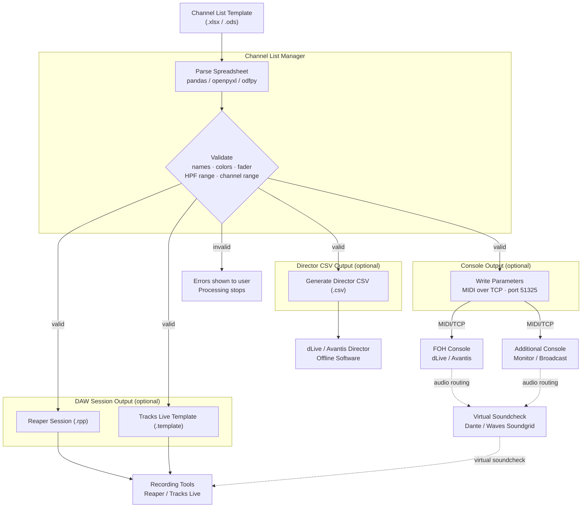
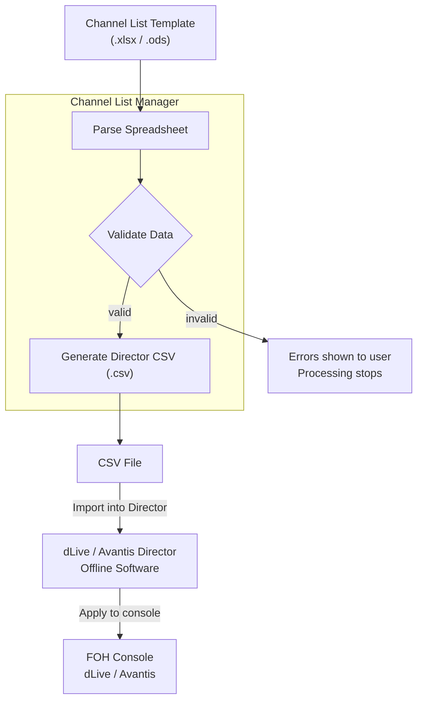
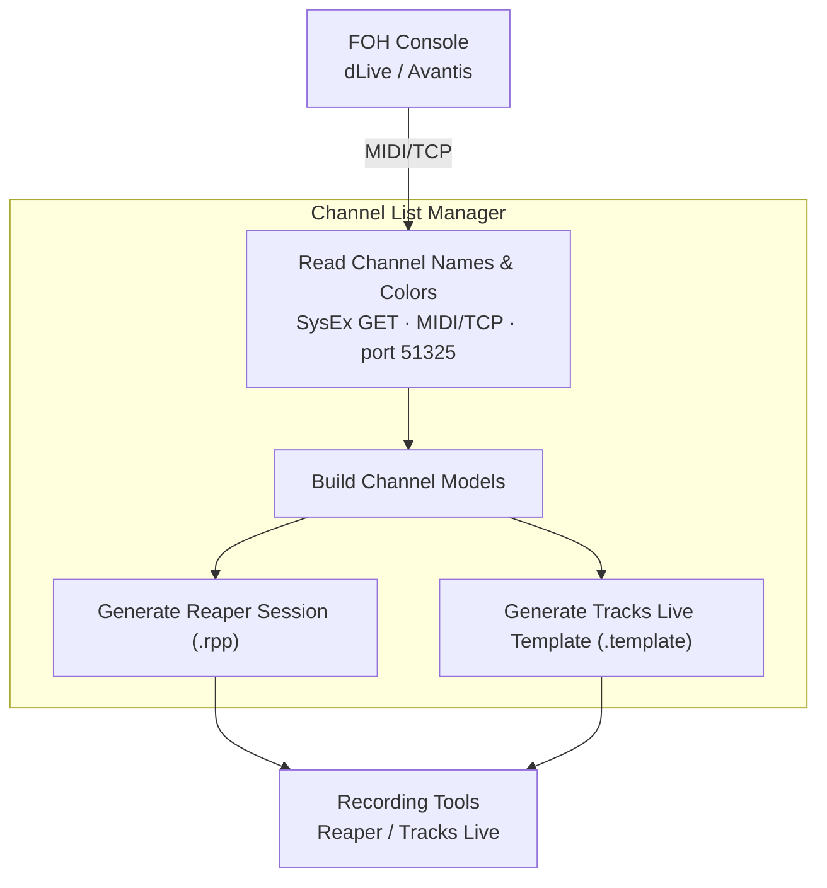
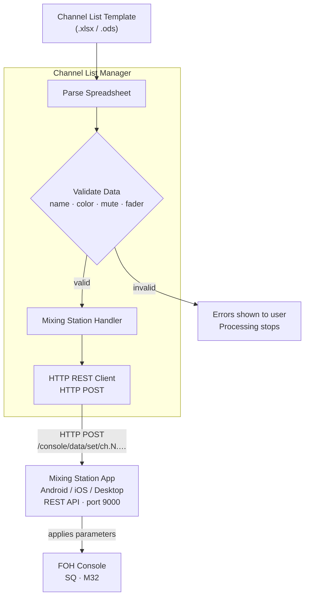
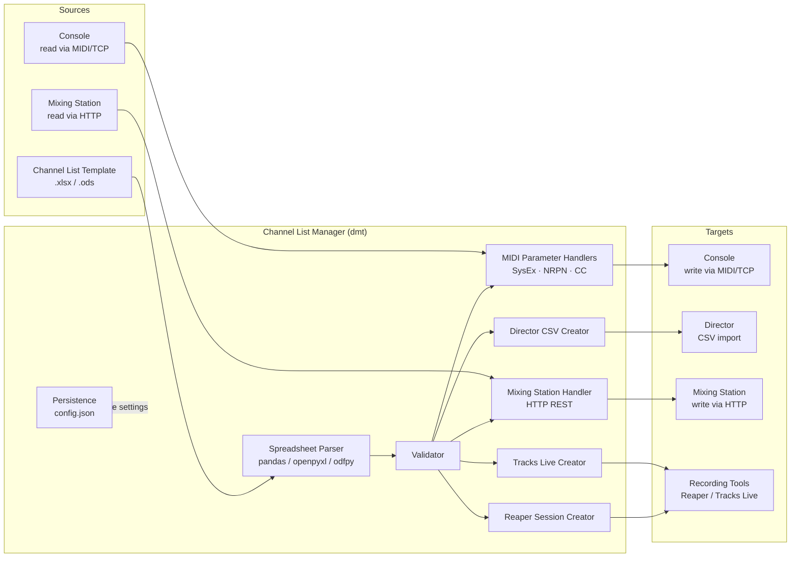

# Workflows & Overview

This document describes the five main workflows supported by **dLive MIDI Tools (dmt)**.
All workflows share the central **Channel List Manager** tool and connect to one or more
external targets (console, Director, Mixing Station, DAW).

The original full overview diagram is available as `doc/overview.drawio.svg` /
`doc/overview.drawio.png`.

---

## Workflow A – Spreadsheet → Console / DAW (dLive / Avantis)

Apply channel list data directly to a connected dLive or Avantis console via MIDI over TCP.
Optionally generate DAW recording session files in the same run.

### Step Sequence

| Step | Action |
|------|--------|
| A1 | Open Channel List Template (.xlsx / .ods) on PC / Mac |
| A2 | *(Optional)* Pre-configure names in dLive / Avantis Director offline first |
| A3 | Channel List Manager parses the spreadsheet |
| A4 | Validator checks names, colors, fader levels, HPF values, channel range |
| A5a | Write channel parameters to FOH console via MIDI/TCP |
| A5b | *(Optional)* Write to additional console (Monitor / Broadcast) |
| A6a | *(Optional)* Generate Reaper recording session (.rpp) |
| A6b | *(Optional)* Generate Tracks Live template (.template) |

### Output Options (configurable in tool)

| Checkbox | Output |
|----------|--------|
| Write to Audio Console or Director | Sends MIDI over TCP to console |
| Generate Director CSV | Creates `.csv` for Director import |
| Generate Reaper Session | Creates `.rpp` session file |
| Generate Tracks Live Template | Creates `.template` file |

**Prerequisites:** Console reachable at the configured IP address on port 51325.

---

## Workflow B – Spreadsheet → Director CSV

Generate a Director-compatible CSV file from the spreadsheet for offline import into
dLive or Avantis Director — no live console connection required.

### Step Sequence

| Step | Action |
|------|--------|
| B1 | Open Channel List Template (.xlsx / .ods) |
| B3 | Channel List Manager parses the spreadsheet |
| B4 | Validator checks data |
| B5 | Generate Director CSV file |
| B6 | Import CSV into dLive / Avantis Director (manual step) |

**Prerequisites:** None for CSV generation (fully offline). dLive Director 1.9x / 2.x or
Avantis Director 1.3x required for the import step.

> **Recommended workflow:** Use Director CSV first to establish a solid channel naming baseline,
> then apply further parameters (routing, mute groups, fader levels) via MIDI in Workflow A.

---

## Workflow C – Console → DAW (dLive / Avantis)

Read current channel names and colors directly from a live console and generate DAW
recording session files — no spreadsheet required.

### Step Sequence

| Step | Action |
|------|--------|
| C1a | Connect to console via MIDI/TCP |
| C1b | Read channel name + color per channel via SysEx GET |
| C2a | Generate Reaper session from channel data |
| C2b | Generate Tracks Live template from channel data |

**Configurable:** Channel range (start / end channel) is set in the tool before reading.

**Prerequisites:** Console reachable at the configured IP address on port 51325.

---

## Workflow D – Spreadsheet → Mixing Station → Console

Apply channel names, colors, mute states, and fader levels to a console via the
**Mixing Station** app REST API. Currently supported console types: SQ and M32.

### Supported Parameters

| Parameter | REST Path | Notes |
|-----------|-----------|-------|
| Channel Name | `ch.{N}.cfg.name` | Max 6 characters |
| Channel Color | `ch.{N}.cfg.color` | Integer 0–7 |
| Mute | `ch.{N}.mix.on` | `true` = unmuted |
| Fader Level | `ch.{N}.mix.lvl` | Float dB value |

### Color Mapping

| ID | Mixing Station | Spreadsheet Value |
|----|---------------|-------------------|
| 0 | Black | `black` |
| 1 | Red | `red` |
| 2 | Green | `green` |
| 3 | Blue | `blue` |
| 4 | Cyan | `light blue` |
| 5 | Yellow | `yellow` |
| 6 | Magenta | `purple` |
| 7 | White | `white` |

**Prerequisites:** Mixing Station running with REST API enabled on port 9000.
Host IP and port are configured in the Connection Settings of the tool.

---

## Workflow E – Console → Mixing Station → DAW

Read channel names and colors from Mixing Station and generate DAW recording session files.

### Step Sequence

| Step | Action |
|------|--------|
| E1 | Connect to Mixing Station (host:port configured in tool) |
| E2 | Read channel name + color per channel via HTTP GET |
| E3 | Build channel models from REST responses |
| E4 | Generate Reaper session and / or Tracks Live template |

**Prerequisites:** Mixing Station running with REST API enabled on port 9000.

---

## Workflow Summary

| # | Workflow | Source | Target | Connection |
|---|----------|--------|--------|------------|
| A | Spreadsheet → Console / DAW | .xlsx / .ods | dLive / Avantis + DAW | MIDI over TCP |
| B | Spreadsheet → Director CSV | .xlsx / .ods | Director (offline) | CSV file |
| C | Console → DAW | dLive / Avantis | Reaper / Tracks Live | MIDI over TCP |
| D | Spreadsheet → Mixing Station | .xlsx / .ods | Console via Mixing Station | HTTP REST |
| E | Mixing Station → DAW | Mixing Station | Reaper / Tracks Live | HTTP REST |

---

## Shared Components

All workflows pass through one or more of these shared components:

See `doc/architecture.md` for full module descriptions, MIDI protocol details,
and the complete console support matrix.
